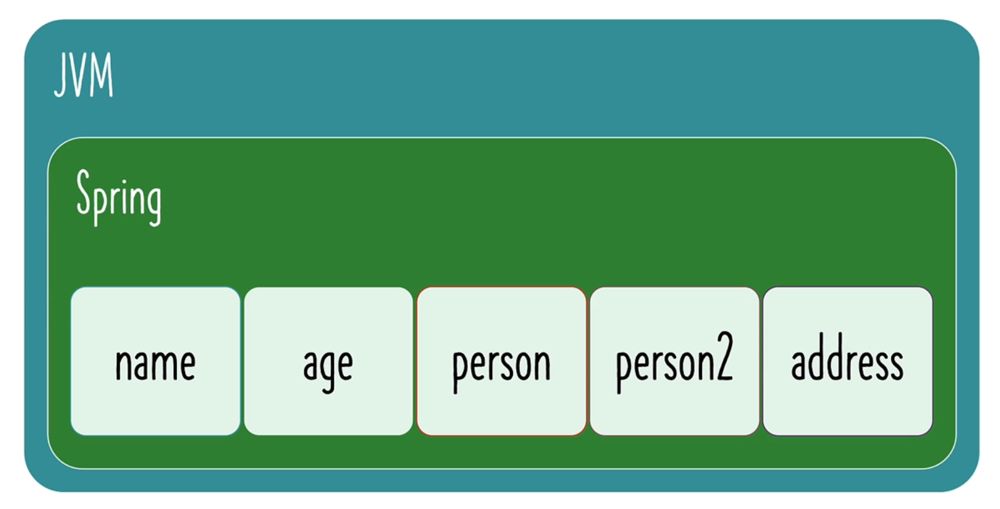
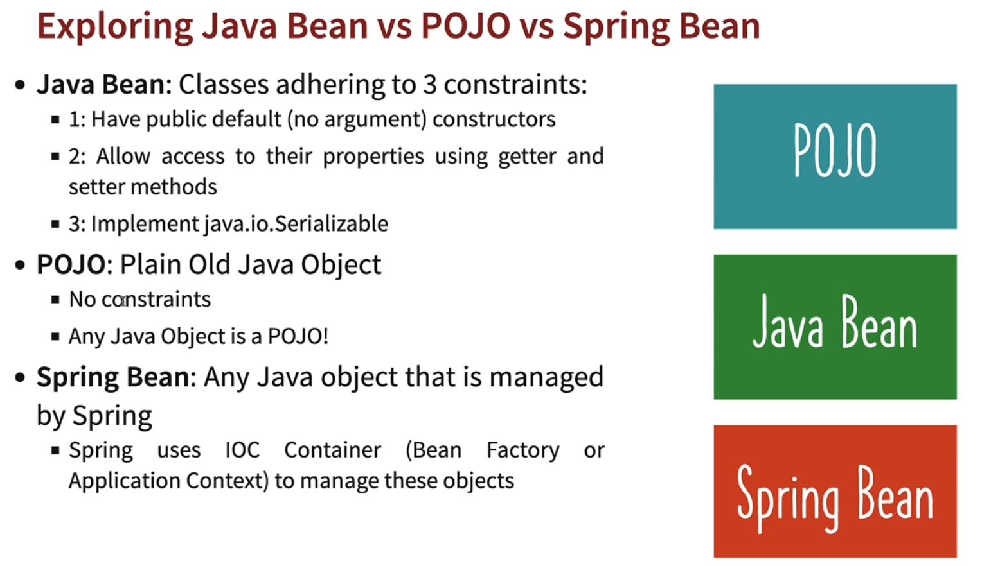

## 002 Step 01 - Understanding the Need for Java Spring Framework


## 003 Step 02 - Getting Started with Java Spring Framework


## 004 Step 03 - Creating a New Spring Framework Project with Maven and Java

go to [start.spring.io](https://start.spring.io/)


## 005 Step 04 - Getting Started with Java Gaming Application


## 006 Step 05 - Understanding Loose Coupling and Tight Coupling


let's say instead of running the supperContra game, we want to run the mario game. We would have to change the `GamingConsole` class to `MarioGame` class. This is called tight coupling. We want to avoid this.


```java
package com.wchamara.learnspringframework.game;

public class SuperContraGame {

    public void up() {
        System.out.println("Jumping");
    }

    public void down() {
        System.out.println("sit down");
    }

    public void left() {
        System.out.println("Go Back");
    }

    public void right() {
        System.out.println("Fire a bullet");
    }
}
```


as you can see GameRunner is tightly coupled with MarioGame. We want to avoid this.

so now if we want to use the `SuperContraGame` class, we would have to change the `GameRunner` class to
use the `SuperContraGame` class.


now we can run the application with the `SuperContraGame` class.


## 007 Step 06 - Introducing Java Interface to Make App Loosely Coupled


let's create a `GamingConsole` interface.

```java
package com.wchamara.learnspringframework.game;

/**
 * The GaminConsole interface represents a gaming console's basic controls.
 * It provides methods to simulate the four main directions of movement in a game: up, down, left, and right.
 */
public interface GaminConsole {

    /**
     * Simulates the action of moving up in a game.
     */
    void up();

    /**
     * Simulates the action of moving down in a game.
     */
    void down();

    /**
     * Simulates the action of moving left in a game.
     */
    void left();

    /**
     * Simulates the action of moving right in a game.
     */
    void right();

}
```

then we can implement the `GamingConsole` interface in the `SuperContraGame` class.

```java
package com.wchamara.learnspringframework.game;

public class SuperContraGame implements GaminConsole {

    public void up() {
        System.out.println("Jumping");
    }

    public void down() {
        System.out.println("sit down");
    }

    public void left() {
        System.out.println("Go Back");
    }

    public void right() {
        System.out.println("Fire a bullet");
    }
}
```

now we can rename the variable to a more abstract name


now inside the gamerunner class, we can use the `GamingConsole` interface instead of the `SuperContraGame` class.

```java
package com.wchamara.learnspringframework.game;

public class GameRunner {

    private GaminConsole game;

    public GameRunner(GaminConsole game) {
        this.game = game;
    }

    public void run() {
        System.out.println("Running the game..." + game);
        game.up();
        game.down();
        game.left();
        game.right();
    }

}
```

now we can use any class that implements the `GamingConsole` interface.


this is called loose coupling.


for now JVM manages the objects. But we want to use the spring framework to manage the objects.

now


this is what we want to achieve.


let's test the spring first


## 008 Step 07 - Bringing in Spring Framework to Make Java App Loosely Coupled


let's create a spring configuration file.


```java
import org.springframework.context.annotation.Configuration;

@Configuration
public class HelloWorldConfiguration {

}
```


@configuration tells spring that this is a configuration file.

now we can create a bean inside the configuration file.

```java
package com.wchamara.learnspringframework;

import org.springframework.context.annotation.AnnotationConfigApplicationContext;

public class App02SpringFramwork {
    public static void main(String[] args) {

        AnnotationConfigApplicationContext context = new AnnotationConfigApplicationContext(
                HelloWorldConfiguration.class);
    }

}

```


`Bean` is an object that is managed by the spring framework.

let's ask spring to manage a bean called name


```java
@Configuration
public class HelloWorldConfiguration {
    @Bean
    public String name() {
        return "Chamara11111111111";
    }

}
```

we can access the bean using the `context` object.

```java
System.out.println(context.getBean("name"));
// Chamara11111111111
```

## 009 Step 08 - Your First Java Spring Bean and Launching Java Spring Configuration

```java
    @Bean
    public String name() {
        return "Chamara11111111111";
    }

    @Bean
    public int age() {
        return 30;
    }

    @Bean
    public Address address() {
        return new Address("No 123", "Galle Road", "Colombo", "Sri Lanka", "12345");
    }
```

```java

        System.out.println(context.getBean("name"));
        System.out.println(context.getBean("age"));
        System.out.println(context.getBean("address"));
```

```bash
Chamara11111111111
30
Address[firtLine=No 123, secondLine=Galle Road, city=Colombo, country=Sri Lanka, zipCode=12345]
```

## 010 Step 09 - Creating More Java Spring Beans in Spring Java Configuration File



we can give custom names to spring beans

```java
    @Bean("yourCustomBeanName")
    public Person person2() {
        return new Person("Chamara", 31);
    }
```

we can call the bean using the custom name

```java
        System.out.println(context.getBean("yourCustomBeanName"));
```

instead of the method name we can pass the class


we can call other beans inside a bean

```java
    @Bean
    public String name() {
        return "Chamara11111111111";
    }

    @Bean
    public int age() {
        return 30;
    }

    @Bean
    public Person person3MethodCall() {
        return new Person(name(), age());
    }
```

we can use parameterized methods


```java
package com.wchamara.learnspringframework;

import org.springframework.context.annotation.Bean;
import org.springframework.context.annotation.Configuration;

/**
 * Person
 * String name
 */
record Person(String name, int age) {
}

record Address(String firtLine, String secondLine, String city, String country, String zipCode) {
}

@Configuration
public class HelloWorldConfiguration {
    @Bean
    public String name() {
        return "Chamara11111111111";
    }

    @Bean
    public int age() {
        return 30;
    }

    @Bean
    public Address address() {
        return new Address("No 123", "Galle Road", "Colombo", "Sri Lanka", "12345");
    }

    @Bean
    public Person person1() {
        return new Person("Chamara", 30);
    }

    @Bean("yourCustomBeanName")
    public Person person2() {
        return new Person("Chamara", 31);
    }

    @Bean
    public Person person3MethodCall() {
        return new Person(name(), age());
    }

    @Bean
    public Person person4MethodCall(String name, int age) {
        return new Person(name, age);
    }

}
```

```java
package com.wchamara.learnspringframework;

import org.springframework.context.annotation.AnnotationConfigApplicationContext;

public class App02SpringFramwork {
    public static void main(String[] args) {

        AnnotationConfigApplicationContext context = new AnnotationConfigApplicationContext(
                HelloWorldConfiguration.class);

        System.out.println(context.getBean("name"));
        System.out.println(context.getBean("age"));
        System.out.println(context.getBean("address"));
        System.out.println(context.getBean("person1"));
        System.out.println(context.getBean("yourCustomBeanName"));
        System.out.println(context.getBean("person3MethodCall"));
        System.out.println(context.getBean("person4MethodCall"));
    }

}
```

## 011 Step 10 - Implementing Auto Wiring in Spring Framework Java Configuration File


## 012 Step 11 - Questions about Spring Framework - What will we learn


## 013 Step 12 - Exploring Spring IOC Container - Application Context & Bean Factory


## 014 Step 13 - Exploring Java Bean vs POJO vs Spring Bean

```java
package com.wchamara.learnspringframework;

import java.io.Serializable;

public class Test {

}

class POJO {
    private String text;
    private int number;

    @Override
    public String toString() {
        return "POJO{" +
                "text='" + text + '\'' +
                ", number=" + number +
                '}';
    }
}

class JavaBean implements Serializable {

    private String text;
    private int number;

    //    no arg constructor
    public JavaBean() {

    }

//    getters ans setters
    public String getText() {
        return text;
    }

    public void setText(String text) {
        this.text = text;
    }

    public int getNumber() {
        return number;
    }

    public void setNumber(int number) {
        this.number = number;
    }

    @Override
    public String toString() {
        return "JavaBean{" +
                "text='" + text + '\'' +
                ", number=" + number +
                '}';
    }
}

```




## 015 Step 14 - Exploring Spring Framework Bean Auto Wiring - Primary & Qualifier

```java
package com.wchamara.learnspringframework;

import org.springframework.context.annotation.AnnotationConfigApplicationContext;

import java.util.Arrays;

public class App02SpringFramwork {
    public static void main(String[] args) {

        AnnotationConfigApplicationContext context = new AnnotationConfigApplicationContext(
                HelloWorldConfiguration.class);
//        this is called method reference
        Arrays.stream(context.getBeanDefinitionNames()).forEach(System.out::println);
    }

}

```

```bash
org.springframework.context.annotation.internalConfigurationAnnotationProcessor
org.springframework.context.annotation.internalAutowiredAnnotationProcessor
org.springframework.context.annotation.internalCommonAnnotationProcessor
org.springframework.context.event.internalEventListenerProcessor
org.springframework.context.event.internalEventListenerFactory
helloWorldConfiguration
name
age
address
person1
yourCustomBeanName
person3MethodCall
person4MethodCall
```

when we have multiple beans of the same type, spring will not know which bean to use. We can use the `@Primary` annotation to tell spring which bean to use.

```java
import org.springframework.context.annotation.Bean;
import org.springframework.context.annotation.Configuration;
import org.springframework.context.annotation.Primary;


    @Bean
    @Primary
    public Person person1() {
        return new Person("Chamara", 30);
    }
```

also we can use @Qualifier to tell spring which bean to use.

```java
import org.springframework.beans.factory.annotation.Qualifier;

    @Bean
    public Person person4MethodCall(@Qualifier("name") String name, @Qualifier("age") int age) {
        return new Person(name, age);
    }
```

```java
        System.out.println(context.getBean("person1"));
        System.out.println(context.getBean("yourCustomBeanName"));
        System.out.println(context.getBean("person3MethodCall"));
        System.out.println(context.getBean("person4MethodCall"));
```

```bash
Person[name=Chamara, age=30]
Person[name=Chamara, age=31]
Person[name=Chamara11111111111, age=30]
Person[name=Chamara11111111111, age=30]
```

```java
package com.wchamara.learnspringframework;

import org.springframework.beans.factory.annotation.Qualifier;
import org.springframework.context.annotation.Bean;
import org.springframework.context.annotation.Configuration;
import org.springframework.context.annotation.Primary;

/**
 * Person
 * String name
 */
record Person(String name, int age, Address address) {
}

record Address(String firtLine, String secondLine, String city, String country, String zipCode) {
}

@Configuration
public class HelloWorldConfiguration {
    @Bean
    public String name() {
        return "Chamara11111111111";
    }

    @Bean
    public int age() {
        return 30;
    }

    @Bean
    @Qualifier("addressQualifier")
    public Address address() {
        return new Address("No 123", "Galle Road", "Colombo", "Sri Lanka", "12345");
    }

    @Bean
    @Primary
    public Person person1() {
        return new Person("Chamara", 30, address());
    }

    @Bean("yourCustomBeanName")
    public Person person2() {
        return new Person("Chamara", 31, address());
    }

    @Bean
    public Person person3MethodCall() {
        return new Person(name(), age(), address());
    }

    @Bean
    public Person person4MethodCall(String name, int age, @Qualifier("addressQualifier") Address address) {
        return new Person(name, age, address);
    }

}

```

```bash
Person[name=Chamara, age=30, address=Address[firtLine=No 123, secondLine=Galle Road, city=Colombo, country=Sri Lanka, zipCode=12345]]
Person[name=Chamara11111111111, age=30, address=Address[firtLine=No 123, secondLine=Galle Road, city=Colombo, country=Sri Lanka, zipCode=12345]]       
```


## 016 Step 15 - Using Spring Framework to Manage Beans for Java Gaming App

let's create a configuration to manage the Game Spring context.

```java
package com.wchamara.learnspringframework;

import com.wchamara.learnspringframework.game.GameRunner;
import com.wchamara.learnspringframework.game.GaminConsole;
import com.wchamara.learnspringframework.game.PacmanGame;
import org.springframework.context.annotation.Bean;
import org.springframework.context.annotation.Configuration;

@Configuration
public class GamingConfiguration {


    @Bean
    public GaminConsole game() {
        return new PacmanGame();
    }

    @Bean
    public GameRunner gameRunner(GaminConsole game) {
        return new GameRunner(game);
    }
}
```

let's create a new class to run the game.

```java
package com.wchamara.learnspringframework;

import com.wchamara.learnspringframework.game.GameRunner;
import com.wchamara.learnspringframework.game.PacmanGame;
import org.springframework.context.annotation.AnnotationConfigApplicationContext;

public class App03GamingBasicSpringBeans {
    public static void main(String[] args) {
        try (AnnotationConfigApplicationContext context = new AnnotationConfigApplicationContext(
                GamingConfiguration.class);
        ) {
            var gameRunner = context.getBean(GameRunner.class);
            gameRunner.run();
        }
    }

}
```

## 017 Step 16 - More Questions about Java Spring Framework - What will we learn

## 018 Step 17 - Exploring Spring Framework With Java - Section 1 - Review
