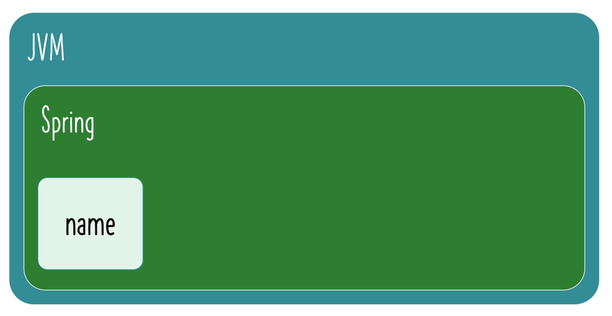

## 002 Step 01 - Understanding the Need for Java Spring Framework

## 003 Step 02 - Getting Started with Java Spring Framework

## 004 Step 03 - Creating a New Spring Framework Project with Maven and Java

go to [start.spring.io](https://start.spring.io/)

## 005 Step 04 - Getting Started with Java Gaming Application

## 006 Step 05 - Understanding Loose Coupling and Tight Coupling

## 007 Step 06 - Introducing Java Interface to Make App Loosely Coupled

## 008 Step 07 - Bringing in Spring Framework to Make Java App Loosely Coupled

## 009 Step 08 - Your First Java Spring Bean and Launching Java Spring Configuration

## 010 Step 09 - Creating More Java Spring Beans in Spring Java Configuration File

# 005 Step 04 - Getting Started with Java Gaming Application

