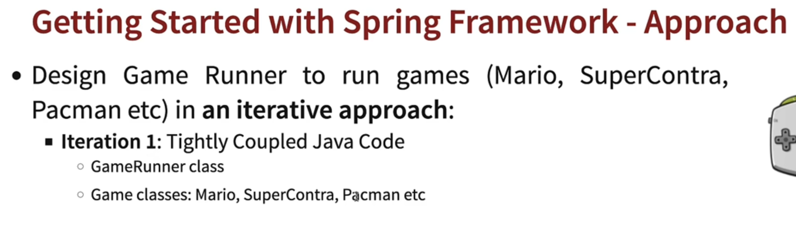

## 002 Step 01 - Understanding the Need for Java Spring Framework


## 003 Step 02 - Getting Started with Java Spring Framework


## 004 Step 03 - Creating a New Spring Framework Project with Maven and Java

go to [start.spring.io](https://start.spring.io/)


## 005 Step 04 - Getting Started with Java Gaming Application




## 006 Step 05 - Understanding Loose Coupling and Tight Coupling


let's say instead of running the supperContra game, we want to run the mario game. We would have to change the `GamingConsole` class to `MarioGame` class. This is called tight coupling. We want to avoid this.


```java
package com.wchamara.learnspringframework.game;

public class SuperContraGame {

    public void up() {
        System.out.println("Jumping");
    }

    public void down() {
        System.out.println("sit down");
    }

    public void left() {
        System.out.println("Go Back");
    }

    public void right() {
        System.out.println("Fire a bullet");
    }
}
```


as you can see GameRunner is tightly coupled with MarioGame. We want to avoid this.

so now if we want to use the `SuperContraGame` class, we would have to change the `GameRunner` class to
use the `SuperContraGame` class.


now we can run the application with the `SuperContraGame` class.


## 007 Step 06 - Introducing Java Interface to Make App Loosely Coupled


let's create a `GamingConsole` interface.

```java
package com.wchamara.learnspringframework.game;

/**
 * The GaminConsole interface represents a gaming console's basic controls.
 * It provides methods to simulate the four main directions of movement in a game: up, down, left, and right.
 */
public interface GaminConsole {

    /**
     * Simulates the action of moving up in a game.
     */
    void up();

    /**
     * Simulates the action of moving down in a game.
     */
    void down();

    /**
     * Simulates the action of moving left in a game.
     */
    void left();

    /**
     * Simulates the action of moving right in a game.
     */
    void right();

}
```

then we can implement the `GamingConsole` interface in the `SuperContraGame` class.

```java
package com.wchamara.learnspringframework.game;

public class SuperContraGame implements GaminConsole {

    public void up() {
        System.out.println("Jumping");
    }

    public void down() {
        System.out.println("sit down");
    }

    public void left() {
        System.out.println("Go Back");
    }

    public void right() {
        System.out.println("Fire a bullet");
    }
}
```

now we can rename the variable to a more abstract name


now inside the gamerunner class, we can use the `GamingConsole` interface instead of the `SuperContraGame` class.

```java
package com.wchamara.learnspringframework.game;

public class GameRunner {

    private GaminConsole game;

    public GameRunner(GaminConsole game) {
        this.game = game;
    }

    public void run() {
        System.out.println("Running the game..." + game);
        game.up();
        game.down();
        game.left();
        game.right();
    }

}
```

now we can use any class that implements the `GamingConsole` interface.


this is called loose coupling.


for now JVM manages the objects. But we want to use the spring framework to manage the objects.

now


this is what we want to achieve.


let's test the spring first


## 008 Step 07 - Bringing in Spring Framework to Make Java App Loosely Coupled


let's create a spring configuration file.


```java
import org.springframework.context.annotation.Configuration;

@Configuration
public class HelloWorldConfiguration {

}
```


@configuration tells spring that this is a configuration file.

now we can create a bean inside the configuration file.

```java
package com.wchamara.learnspringframework;

import org.springframework.context.annotation.AnnotationConfigApplicationContext;

public class App02SpringFramwork {
    public static void main(String[] args) {

        AnnotationConfigApplicationContext context = new AnnotationConfigApplicationContext(
                HelloWorldConfiguration.class);
    }

}

```


`Bean` is an object that is managed by the spring framework.

let's ask spring to manage a bean called name


```java
@Configuration
public class HelloWorldConfiguration {
    @Bean
    public String name() {
        return "Chamara11111111111";
    }

}
```

we can access the bean using the `context` object.

```java
System.out.println(context.getBean("name"));
// Chamara11111111111
```

## 009 Step 08 - Your First Java Spring Bean and Launching Java Spring Configuration

## 010 Step 09 - Creating More Java Spring Beans in Spring Java Configuration File
