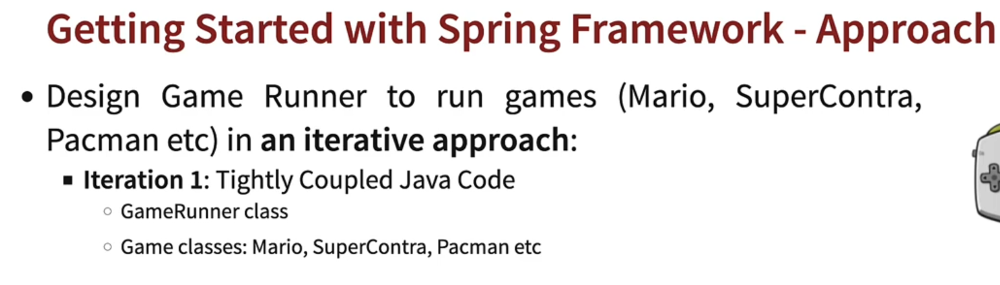

## 002 Step 01 - Understanding the Need for Java Spring Framework


## 003 Step 02 - Getting Started with Java Spring Framework


## 004 Step 03 - Creating a New Spring Framework Project with Maven and Java

go to [start.spring.io](https://start.spring.io/)


## 005 Step 04 - Getting Started with Java Gaming Application


## 006 Step 05 - Understanding Loose Coupling and Tight Coupling



let's say instead of running the supperContra game, we want to run the mario game. We would have to change the `GamingConsole` class to `MarioGame` class. This is called tight coupling. We want to avoid this.


```java
package com.wchamara.learnspringframework.game;

public class SuperContraGame {

    public void up() {
        System.out.println("Jumping");
    }

    public void down() {
        System.out.println("sit down");
    }

    public void left() {
        System.out.println("Go Back");
    }

    public void right() {
        System.out.println("Fire a bullet");
    }
}
```


as you can see GameRunner is tightly coupled with MarioGame. We want to avoid this.

so now if we want to use the `SuperContraGame` class, we would have to change the `GameRunner` class to
use the `SuperContraGame` class.


now we can run the application with the `SuperContraGame` class.


## 007 Step 06 - Introducing Java Interface to Make App Loosely Coupled

## 008 Step 07 - Bringing in Spring Framework to Make Java App Loosely Coupled

## 009 Step 08 - Your First Java Spring Bean and Launching Java Spring Configuration

## 010 Step 09 - Creating More Java Spring Beans in Spring Java Configuration File
