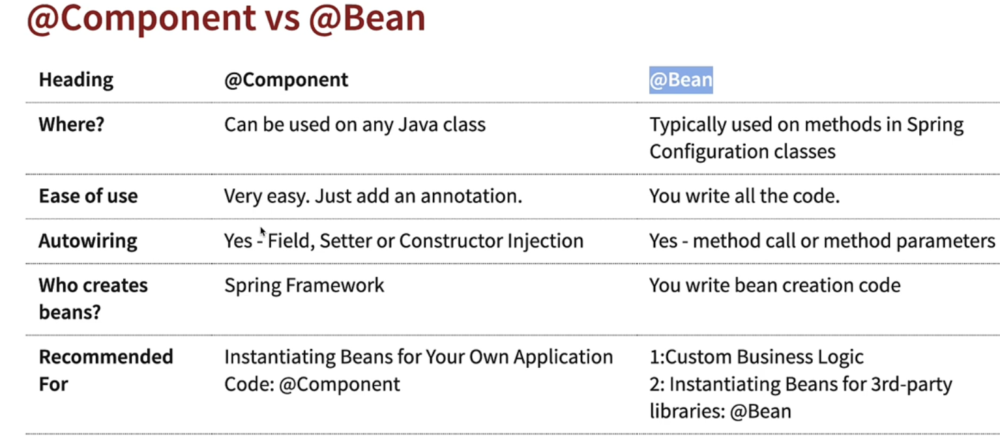

# 03---Using-Spring-Framework-to-Create-and-Manage-Your-Java-Objects

## 001 Step 01 - Getting Spring Framework to Create and Manage Your Java Objects

we can't have two public classes in the same file.

let's move the GamingConfiguration class to the `App03GamingBasicSpringBeans` class.

```java
package com.wchamara.learnspringframework;

import com.wchamara.learnspringframework.game.GameRunner;
import com.wchamara.learnspringframework.game.PacmanGame;
import org.springframework.context.annotation.AnnotationConfigApplicationContext;
@Configuration
class GamingConfiguration {
    @Bean
    public GaminConsole game() {
        return new PacmanGame();
    }

    @Bean
    public GameRunner gameRunner(GaminConsole game) {
        return new GameRunner(game);
    }
}

public class App03GamingBasicSpringBeans {
    public static void main(String[] args) {
        try (AnnotationConfigApplicationContext context = new AnnotationConfigApplicationContext(
                GamingConfiguration.class);
        ) {
            var gameRunner = context.getBean(GameRunner.class);
            gameRunner.run();
        }
    }

}
```

let's move the means inside the `App03GamingBasicSpringBeans` class.

```java
package com.wchamara.learnspringframework;

import com.wchamara.learnspringframework.game.GameRunner;
import com.wchamara.learnspringframework.game.GaminConsole;
import com.wchamara.learnspringframework.game.PacmanGame;
import org.springframework.context.annotation.AnnotationConfigApplicationContext;
import org.springframework.context.annotation.Bean;
import org.springframework.context.annotation.Configuration;

@Configuration
public class App03GamingBasicSpringBeans {
    @Bean
    public GaminConsole game() {
        return new PacmanGame();
    }

    @Bean
    public GameRunner gameRunner(GaminConsole game) {
        return new GameRunner(game);
    }

    public static void main(String[] args) {
        try (AnnotationConfigApplicationContext context = new AnnotationConfigApplicationContext(
                App03GamingBasicSpringBeans.class);
        ) {
            var gameRunner = context.getBean(GameRunner.class);
            gameRunner.run();
        }
    }

}
```

we have simplify the code by removing the `GamingConfiguration` class and moving the `@Bean` methods to the `App03GamingBasicSpringBeans` class.

but we are still creating the objects manually.

let's make the MarioGame class a @Component.
@Componet is a stereotype annotation.
which means it is a special kind of annotation that tells spring that this class is a spring
component.

```java
package com.wchamara.learnspringframework.game;

import org.springframework.stereotype.Component;

@Component
public class PacmanGame implements GaminConsole {

    public void up() {
```

let's run the application

```bash
16:02:24.427 [main] WARN org.springframework.context.annotation.AnnotationConfigApplicationContext -- Exception encountered during context initialization - cancelling refresh attempt: org.springframework.beans.factory.UnsatisfiedDependencyException: Error creating bean with name 'gameRunner' defined in com.wchamara.learnspringframework.App03GamingBasicSpringBeans: Unsatisfied dependency expressed through method 'gameRunner' parameter 0: No qualifying bean of type 'com.wchamara.learnspringframework.game.GaminConsole' available: expected at least 1 bean which qualifies as autowire candidate. Dependency annotations: {}
Exception in thread "main" org.springframework.beans.factory.UnsatisfiedDependencyException: Error creating bean with name 'gameRunner' defined in com.wchamara.learnspringframework.App03GamingBasicSpringBeans: Unsatisfied dependency expressed through method 'gameRunner' parameter 0: No qualifying bean of type 'com.wchamara.learnspringframework.game.GaminConsole' available: expected at least 1 bean which qualifies as autowire candidate. Dependency annotations: {}
 at org.springframework.beans.factory.support.ConstructorResolver.createArgumentArray(ConstructorResolver.java:798)
 at org.springframework.beans.factory.support.ConstructorResolver.instantiateUsingFactoryMethod(ConstructorResolver.java:542)
 at org.springframework.beans.factory.support.AbstractAutowireCapableBeanFactory.instantiateUsingFactoryMethod(AbstractAutowireCapableBeanFactory.java:1334)
 at org.springframework.beans.factory.support.AbstractAutowireCapableBeanFactory.createBeanInstance(AbstractAutowireCapableBeanFactory.java:1164)
 at org.springframework.beans.factory.support.AbstractAutowireCapableBeanFactory.doCreateBean(AbstractAutowireCapableBeanFactory.java:561)
 at org.springframework.beans.factory.support.AbstractAutowireCapableBeanFactory.createBean(AbstractAutowireCapableBeanFactory.java:521)
 at org.springframework.beans.factory.support.AbstractBeanFactory.lambda$doGetBean$0(AbstractBeanFactory.java:325)
 at org.springframework.beans.factory.support.DefaultSingletonBeanRegistry.getSingleton(DefaultSingletonBeanRegistry.java:234)
 at org.springframework.beans.factory.support.AbstractBeanFactory.doGetBean(AbstractBeanFactory.java:323)
 at org.springframework.beans.factory.support.AbstractBeanFactory.getBean(AbstractBeanFactory.java:199)
 at org.springframework.beans.factory.support.DefaultListableBeanFactory.preInstantiateSingletons(DefaultListableBeanFactory.java:975)
 at org.springframework.context.support.AbstractApplicationContext.finishBeanFactoryInitialization(AbstractApplicationContext.java:959)
 at org.springframework.context.support.AbstractApplicationContext.refresh(AbstractApplicationContext.java:624)
 at org.springframework.context.annotation.AnnotationConfigApplicationContext.<init>(AnnotationConfigApplicationContext.java:93)
 at com.wchamara.learnspringframework.App03GamingBasicSpringBeans.main(App03GamingBasicSpringBeans.java:19)
Caused by: org.springframework.beans.factory.NoSuchBeanDefinitionException: No qualifying bean of type 'com.wchamara.learnspringframework.game.GaminConsole' available: expected at least 1 bean which qualifies as autowire candidate. Dependency annotations: {}
 at org.springframework.beans.factory.support.DefaultListableBeanFactory.raiseNoMatchingBeanFound(DefaultListableBeanFactory.java:1880)
 at org.springframework.beans.factory.support.DefaultListableBeanFactory.doResolveDependency(DefaultListableBeanFactory.java:1406)
 at org.springframework.beans.factory.support.DefaultListableBeanFactory.resolveDependency(DefaultListableBeanFactory.java:1353)
 at org.springframework.beans.factory.support.ConstructorResolver.resolveAutowiredArgument(ConstructorResolver.java:907)
 at org.springframework.beans.factory.support.ConstructorResolver.createArgumentArray(ConstructorResolver.java:785)
 ... 14 more

Process finished with exit code 1
```

as you can see we have an error.
because spring doesn't know where to find the `PacmanGame` bean.

so we have add @ComponentScan to the `App03GamingBasicSpringBeans` class.

```java
learn-spring-framework\src\main\java\com\wchamara\learnspringframework\App03GamingBasicSpringBeans.java
package com.wchamara.learnspringframework;

import com.wchamara.learnspringframework.game.GameRunner;
import com.wchamara.learnspringframework.game.GaminConsole;
import com.wchamara.learnspringframework.game.PacmanGame;
import org.springframework.context.annotation.AnnotationConfigApplicationContext;
import org.springframework.context.annotation.Bean;
import org.springframework.context.annotation.ComponentScan;
import org.springframework.context.annotation.Configuration;

@Configuration
@ComponentScan("com.wchamara.learnspringframework.game")
public class App03GamingBasicSpringBeans {
    @Bean
    public GameRunner gameRunner(GaminConsole game) {
        return new GameRunner(game);
    }

    public static void main(String[] args) {
        try (AnnotationConfigApplicationContext context = new AnnotationConfigApplicationContext(
                App03GamingBasicSpringBeans.class);
        ) {
            var gameRunner = context.getBean(GameRunner.class);
            gameRunner.run();
```

let's run the application

```bash
C:\Users\USER\.jdks\openjdk-21.0.2\bin\java.exe "-javaagent:C:\Users\USER\AppData\Local\Programs\IntelliJ IDEA Ultimate\lib\idea_rt.jar=61837:C:\Users\USER\AppData\Local\Programs\IntelliJ IDEA Ultimate\bin" -Dfile.encoding=UTF-8 -Dsun.stdout.encoding=UTF-8 -Dsun.stderr.encoding=UTF-8 -classpath C:\Users\USER\Documents\GitHub\Master-Spring-Boot3&Spring-Framework-6-with-Java\learn-spring-framework\target\classes;C:\Users\USER\.m2\repository\org\springframework\boot\spring-boot-starter\3.2.2\spring-boot-starter-3.2.2.jar;C:\Users\USER\.m2\repository\org\springframework\boot\spring-boot\3.2.2\spring-boot-3.2.2.jar;C:\Users\USER\.m2\repository\org\springframework\spring-context\6.1.3\spring-context-6.1.3.jar;C:\Users\USER\.m2\repository\org\springframework\spring-aop\6.1.3\spring-aop-6.1.3.jar;C:\Users\USER\.m2\repository\org\springframework\spring-beans\6.1.3\spring-beans-6.1.3.jar;C:\Users\USER\.m2\repository\org\springframework\spring-expression\6.1.3\spring-expression-6.1.3.jar;C:\Users\USER\.m2\repository\io\micrometer\micrometer-observation\1.12.2\micrometer-observation-1.12.2.jar;C:\Users\USER\.m2\repository\io\micrometer\micrometer-commons\1.12.2\micrometer-commons-1.12.2.jar;C:\Users\USER\.m2\repository\org\springframework\boot\spring-boot-autoconfigure\3.2.2\spring-boot-autoconfigure-3.2.2.jar;C:\Users\USER\.m2\repository\org\springframework\boot\spring-boot-starter-logging\3.2.2\spring-boot-starter-logging-3.2.2.jar;C:\Users\USER\.m2\repository\ch\qos\logback\logback-classic\1.4.14\logback-classic-1.4.14.jar;C:\Users\USER\.m2\repository\ch\qos\logback\logback-core\1.4.14\logback-core-1.4.14.jar;C:\Users\USER\.m2\repository\org\apache\logging\log4j\log4j-to-slf4j\2.21.1\log4j-to-slf4j-2.21.1.jar;C:\Users\USER\.m2\repository\org\apache\logging\log4j\log4j-api\2.21.1\log4j-api-2.21.1.jar;C:\Users\USER\.m2\repository\org\slf4j\jul-to-slf4j\2.0.11\jul-to-slf4j-2.0.11.jar;C:\Users\USER\.m2\repository\jakarta\annotation\jakarta.annotation-api\2.1.1\jakarta.annotation-api-2.1.1.jar;C:\Users\USER\.m2\repository\org\springframework\spring-core\6.1.3\spring-core-6.1.3.jar;C:\Users\USER\.m2\repository\org\springframework\spring-jcl\6.1.3\spring-jcl-6.1.3.jar;C:\Users\USER\.m2\repository\org\yaml\snakeyaml\2.2\snakeyaml-2.2.jar;C:\Users\USER\.m2\repository\org\slf4j\slf4j-api\2.0.11\slf4j-api-2.0.11.jar com.wchamara.learnspringframework.App03GamingBasicSpringBeans
Running the game...com.wchamara.learnspringframework.game.PacmanGame@2805d709
Going up
Going down
Going left
Going right

Process finished with exit code 0

```

as you can see the application is running without any errors.

but we are still creating the `GameRunner` object manually.

let's make the `GameRunner` class a @Component.

```java
import org.springframework.stereotype.Component;

@Component
public class GameRunner {

    private GaminConsole game;
```

and remove the `@Bean` method from the `App03GamingBasicSpringBeans` class.

```java
    @Bean
    public GameRunner gameRunner(GaminConsole game) {
        return new GameRunner(game);
    }
```

by doing so we were able to remove the `@Bean` method from the `App03GamingBasicSpringBeans` class.
and let spring create the `GameRunner` object for us.

## 003 Step 02 - Exploring Primary and Qualifier Annotations for Spring Components

we have multiple implementation of `GaminConsole` so spring doesn't know which one to use.

therefore we have to use the `@Primary` annotation to tell spring which implementation to use.
or we can use the `@Qualifier` annotation to tell spring which implementation to use.

```java
package com.wchamara.learnspringframework.game;

import org.springframework.context.annotation.Primary;
import org.springframework.stereotype.Component;

@Component
@Primary
public class MarioGame implements GaminConsole {

    public void up() {
```

```java
package com.wchamara.learnspringframework.game;

import org.springframework.beans.factory.annotation.Qualifier;
import org.springframework.stereotype.Component;

@Component
@Qualifier("superContraQualifier")
public class SuperContraGame implements GaminConsole {

    public void up() {
```

```java
package com.wchamara.learnspringframework.game;

import org.springframework.beans.factory.annotation.Qualifier;
import org.springframework.stereotype.Component;

@Component

public class GameRunner {

    private GaminConsole game;

    public GameRunner(@Qualifier("superContraQualifier") GaminConsole game) {
        this.game = game;
    }
```

output

```bash
C:\Users\USER\.jdks\openjdk-21.0.2\bin\java.exe "-javaagent:C:\Users\USER\AppData\Local\Programs\IntelliJ IDEA Ultimate\lib\idea_rt.jar=49907:C:\Users\USER\AppData\Local\Programs\IntelliJ IDEA Ultimate\bin" -Dfile.encoding=UTF-8 -Dsun.stdout.encoding=UTF-8 -Dsun.stderr.encoding=UTF-8 -classpath C:\Users\USER\Documents\GitHub\Master-Spring-Boot3&Spring-Framework-6-with-Java\learn-spring-framework\target\classes;C:\Users\USER\.m2\repository\org\springframework\boot\spring-boot-starter\3.2.2\spring-boot-starter-3.2.2.jar;C:\Users\USER\.m2\repository\org\springframework\boot\spring-boot\3.2.2\spring-boot-3.2.2.jar;C:\Users\USER\.m2\repository\org\springframework\spring-context\6.1.3\spring-context-6.1.3.jar;C:\Users\USER\.m2\repository\org\springframework\spring-aop\6.1.3\spring-aop-6.1.3.jar;C:\Users\USER\.m2\repository\org\springframework\spring-beans\6.1.3\spring-beans-6.1.3.jar;C:\Users\USER\.m2\repository\org\springframework\spring-expression\6.1.3\spring-expression-6.1.3.jar;C:\Users\USER\.m2\repository\io\micrometer\micrometer-observation\1.12.2\micrometer-observation-1.12.2.jar;C:\Users\USER\.m2\repository\io\micrometer\micrometer-commons\1.12.2\micrometer-commons-1.12.2.jar;C:\Users\USER\.m2\repository\org\springframework\boot\spring-boot-autoconfigure\3.2.2\spring-boot-autoconfigure-3.2.2.jar;C:\Users\USER\.m2\repository\org\springframework\boot\spring-boot-starter-logging\3.2.2\spring-boot-starter-logging-3.2.2.jar;C:\Users\USER\.m2\repository\ch\qos\logback\logback-classic\1.4.14\logback-classic-1.4.14.jar;C:\Users\USER\.m2\repository\ch\qos\logback\logback-core\1.4.14\logback-core-1.4.14.jar;C:\Users\USER\.m2\repository\org\apache\logging\log4j\log4j-to-slf4j\2.21.1\log4j-to-slf4j-2.21.1.jar;C:\Users\USER\.m2\repository\org\apache\logging\log4j\log4j-api\2.21.1\log4j-api-2.21.1.jar;C:\Users\USER\.m2\repository\org\slf4j\jul-to-slf4j\2.0.11\jul-to-slf4j-2.0.11.jar;C:\Users\USER\.m2\repository\jakarta\annotation\jakarta.annotation-api\2.1.1\jakarta.annotation-api-2.1.1.jar;C:\Users\USER\.m2\repository\org\springframework\spring-core\6.1.3\spring-core-6.1.3.jar;C:\Users\USER\.m2\repository\org\springframework\spring-jcl\6.1.3\spring-jcl-6.1.3.jar;C:\Users\USER\.m2\repository\org\yaml\snakeyaml\2.2\snakeyaml-2.2.jar;C:\Users\USER\.m2\repository\org\slf4j\slf4j-api\2.0.11\slf4j-api-2.0.11.jar com.wchamara.learnspringframework.GamingAppLauncherApplication
Running the game...com.wchamara.learnspringframework.game.SuperContraGame@bae7dc0
Jumping
sit down
Go Back
Fire a bullet

Process finished with exit code 0
```

## 004 Step 03 - Primary and Qualifier - Which Spring Annotation Should You Use


## 005 Step 04 - Exploring Spring Framework - Different Types of Dependency Injection


let's create a new Application Runner class.

```java
package com.wchamara.learnspringframework.examples.a1;

import org.springframework.context.annotation.AnnotationConfigApplicationContext;
import org.springframework.context.annotation.ComponentScan;
import org.springframework.context.annotation.Configuration;

import java.util.Arrays;

@Configuration
@ComponentScan
public class DependencyInjectionAppLauncherApplication {

    public static void main(String[] args) {
        try (AnnotationConfigApplicationContext context = new AnnotationConfigApplicationContext(
                DependencyInjectionAppLauncherApplication.class);
        ) {
            Arrays.stream(context.getBeanDefinitionNames()).forEach(System.out::println);
        }
    }

}

```

Field Injection

```java
package com.wchamara.learnspringframework.examples.a1;

import org.springframework.beans.factory.annotation.Autowired;
import org.springframework.context.annotation.AnnotationConfigApplicationContext;
import org.springframework.context.annotation.ComponentScan;
import org.springframework.context.annotation.Configuration;
import org.springframework.stereotype.Component;

import java.util.Arrays;

@Component
class YourBusinessClass {
    @Autowired
    private Dependency1 dependency1;
    @Autowired
    private Dependency2 dependency2;

    @Override
    public String toString() {
        return "YourBusinessClass{" +
                "dependency1=" + dependency1 +
                ", dependency2=" + dependency2 +
                '}';
    }
}

@Component
class Dependency1 {
}

@Component
class Dependency2 {
}


@Configuration
@ComponentScan
public class DependencyInjectionAppLauncherApplication {

    public static void main(String[] args) {
        try (AnnotationConfigApplicationContext context = new AnnotationConfigApplicationContext(
                DependencyInjectionAppLauncherApplication.class);
        ) {
            System.out.println(context.getBean(YourBusinessClass.class));
        }
    }

}
```

```bash
C:\Users\USER\.jdks\openjdk-21.0.2\bin\java.exe "-javaagent:C:\Users\USER\AppData\Local\Programs\IntelliJ IDEA Ultimate\lib\idea_rt.jar=56947:C:\Users\USER\AppData\Local\Programs\IntelliJ IDEA Ultimate\bin" -Dfile.encoding=UTF-8 -Dsun.stdout.encoding=UTF-8 -Dsun.stderr.encoding=UTF-8 -classpath C:\Users\USER\Documents\GitHub\Master-Spring-Boot3&Spring-Framework-6-with-Java\learn-spring-framework\target\classes;C:\Users\USER\.m2\repository\org\springframework\boot\spring-boot-starter\3.2.2\spring-boot-starter-3.2.2.jar;C:\Users\USER\.m2\repository\org\springframework\boot\spring-boot\3.2.2\spring-boot-3.2.2.jar;C:\Users\USER\.m2\repository\org\springframework\spring-context\6.1.3\spring-context-6.1.3.jar;C:\Users\USER\.m2\repository\org\springframework\spring-aop\6.1.3\spring-aop-6.1.3.jar;C:\Users\USER\.m2\repository\org\springframework\spring-beans\6.1.3\spring-beans-6.1.3.jar;C:\Users\USER\.m2\repository\org\springframework\spring-expression\6.1.3\spring-expression-6.1.3.jar;C:\Users\USER\.m2\repository\io\micrometer\micrometer-observation\1.12.2\micrometer-observation-1.12.2.jar;C:\Users\USER\.m2\repository\io\micrometer\micrometer-commons\1.12.2\micrometer-commons-1.12.2.jar;C:\Users\USER\.m2\repository\org\springframework\boot\spring-boot-autoconfigure\3.2.2\spring-boot-autoconfigure-3.2.2.jar;C:\Users\USER\.m2\repository\org\springframework\boot\spring-boot-starter-logging\3.2.2\spring-boot-starter-logging-3.2.2.jar;C:\Users\USER\.m2\repository\ch\qos\logback\logback-classic\1.4.14\logback-classic-1.4.14.jar;C:\Users\USER\.m2\repository\ch\qos\logback\logback-core\1.4.14\logback-core-1.4.14.jar;C:\Users\USER\.m2\repository\org\apache\logging\log4j\log4j-to-slf4j\2.21.1\log4j-to-slf4j-2.21.1.jar;C:\Users\USER\.m2\repository\org\apache\logging\log4j\log4j-api\2.21.1\log4j-api-2.21.1.jar;C:\Users\USER\.m2\repository\org\slf4j\jul-to-slf4j\2.0.11\jul-to-slf4j-2.0.11.jar;C:\Users\USER\.m2\repository\jakarta\annotation\jakarta.annotation-api\2.1.1\jakarta.annotation-api-2.1.1.jar;C:\Users\USER\.m2\repository\org\springframework\spring-core\6.1.3\spring-core-6.1.3.jar;C:\Users\USER\.m2\repository\org\springframework\spring-jcl\6.1.3\spring-jcl-6.1.3.jar;C:\Users\USER\.m2\repository\org\yaml\snakeyaml\2.2\snakeyaml-2.2.jar;C:\Users\USER\.m2\repository\org\slf4j\slf4j-api\2.0.11\slf4j-api-2.0.11.jar com.wchamara.learnspringframework.examples.a1.DependencyInjectionAppLauncherApplication
YourBusinessClass{dependency1=com.wchamara.learnspringframework.examples.a1.Dependency1@20ccf40b, dependency2=com.wchamara.learnspringframework.examples.a1.Dependency2@2fb3536e}

Process finished with exit code 0

```

Setter Injection

```java
package com.wchamara.learnspringframework.examples.a1;

import org.springframework.beans.factory.annotation.Autowired;
import org.springframework.context.annotation.AnnotationConfigApplicationContext;
import org.springframework.context.annotation.ComponentScan;
import org.springframework.context.annotation.Configuration;
import org.springframework.stereotype.Component;

import java.util.Arrays;

@Component
class YourBusinessClass {

    private Dependency1 dependency1;

    private Dependency2 dependency2;

    @Autowired
    public void setDependency1(Dependency1 dependency1) {
        System.out.println("Setting dependency1");
        this.dependency1 = dependency1;
    }

    @Autowired
    public void setDependency2(Dependency2 dependency2) {
        System.out.println("Setting dependency2");
        this.dependency2 = dependency2;
    }

    @Override
    public String toString() {
        return "YourBusinessClass{" +
                "dependency1=" + dependency1 +
                ", dependency2=" + dependency2 +
                '}';
    }
}

@Component
class Dependency1 {
}

@Component
class Dependency2 {
}


@Configuration
@ComponentScan
public class DependencyInjectionAppLauncherApplication {

    public static void main(String[] args) {
        try (AnnotationConfigApplicationContext context = new AnnotationConfigApplicationContext(
                DependencyInjectionAppLauncherApplication.class);
        ) {
            System.out.println(context.getBean(YourBusinessClass.class));
        }
    }

}

```

```bash
C:\Users\USER\.jdks\openjdk-21.0.2\bin\java.exe "-javaagent:C:\Users\USER\AppData\Local\Programs\IntelliJ IDEA Ultimate\lib\idea_rt.jar=56975:C:\Users\USER\AppData\Local\Programs\IntelliJ IDEA Ultimate\bin" -Dfile.encoding=UTF-8 -Dsun.stdout.encoding=UTF-8 -Dsun.stderr.encoding=UTF-8 -classpath C:\Users\USER\Documents\GitHub\Master-Spring-Boot3&Spring-Framework-6-with-Java\learn-spring-framework\target\classes;C:\Users\USER\.m2\repository\org\springframework\boot\spring-boot-starter\3.2.2\spring-boot-starter-3.2.2.jar;C:\Users\USER\.m2\repository\org\springframework\boot\spring-boot\3.2.2\spring-boot-3.2.2.jar;C:\Users\USER\.m2\repository\org\springframework\spring-context\6.1.3\spring-context-6.1.3.jar;C:\Users\USER\.m2\repository\org\springframework\spring-aop\6.1.3\spring-aop-6.1.3.jar;C:\Users\USER\.m2\repository\org\springframework\spring-beans\6.1.3\spring-beans-6.1.3.jar;C:\Users\USER\.m2\repository\org\springframework\spring-expression\6.1.3\spring-expression-6.1.3.jar;C:\Users\USER\.m2\repository\io\micrometer\micrometer-observation\1.12.2\micrometer-observation-1.12.2.jar;C:\Users\USER\.m2\repository\io\micrometer\micrometer-commons\1.12.2\micrometer-commons-1.12.2.jar;C:\Users\USER\.m2\repository\org\springframework\boot\spring-boot-autoconfigure\3.2.2\spring-boot-autoconfigure-3.2.2.jar;C:\Users\USER\.m2\repository\org\springframework\boot\spring-boot-starter-logging\3.2.2\spring-boot-starter-logging-3.2.2.jar;C:\Users\USER\.m2\repository\ch\qos\logback\logback-classic\1.4.14\logback-classic-1.4.14.jar;C:\Users\USER\.m2\repository\ch\qos\logback\logback-core\1.4.14\logback-core-1.4.14.jar;C:\Users\USER\.m2\repository\org\apache\logging\log4j\log4j-to-slf4j\2.21.1\log4j-to-slf4j-2.21.1.jar;C:\Users\USER\.m2\repository\org\apache\logging\log4j\log4j-api\2.21.1\log4j-api-2.21.1.jar;C:\Users\USER\.m2\repository\org\slf4j\jul-to-slf4j\2.0.11\jul-to-slf4j-2.0.11.jar;C:\Users\USER\.m2\repository\jakarta\annotation\jakarta.annotation-api\2.1.1\jakarta.annotation-api-2.1.1.jar;C:\Users\USER\.m2\repository\org\springframework\spring-core\6.1.3\spring-core-6.1.3.jar;C:\Users\USER\.m2\repository\org\springframework\spring-jcl\6.1.3\spring-jcl-6.1.3.jar;C:\Users\USER\.m2\repository\org\yaml\snakeyaml\2.2\snakeyaml-2.2.jar;C:\Users\USER\.m2\repository\org\slf4j\slf4j-api\2.0.11\slf4j-api-2.0.11.jar com.wchamara.learnspringframework.examples.a1.DependencyInjectionAppLauncherApplication
Setting dependency1
Setting dependency2
YourBusinessClass{dependency1=com.wchamara.learnspringframework.examples.a1.Dependency1@17497425, dependency2=com.wchamara.learnspringframework.examples.a1.Dependency2@f0da945}

Process finished with exit code 0

```

Constructor Injection

```java
package com.wchamara.learnspringframework.examples.a1;

import org.springframework.beans.factory.annotation.Autowired;
import org.springframework.context.annotation.AnnotationConfigApplicationContext;
import org.springframework.context.annotation.ComponentScan;
import org.springframework.context.annotation.Configuration;
import org.springframework.stereotype.Component;

import java.util.Arrays;

@Component
class YourBusinessClass {

    private final Dependency1 dependency1;

    private final Dependency2 dependency2;

    @Autowired
    public YourBusinessClass(Dependency1 dependency1, Dependency2 dependency2) {
        System.out.println("YourBusinessClass constructor");
        this.dependency1 = dependency1;
        this.dependency2 = dependency2;
    }

    @Override
    public String toString() {
        return "YourBusinessClass{" +
                "dependency1=" + dependency1 +
                ", dependency2=" + dependency2 +
                '}';
    }
}

@Component
class Dependency1 {
}

@Component
class Dependency2 {
}


@Configuration
@ComponentScan
public class DependencyInjectionAppLauncherApplication {

    public static void main(String[] args) {
        try (AnnotationConfigApplicationContext context = new AnnotationConfigApplicationContext(
                DependencyInjectionAppLauncherApplication.class);
        ) {
            System.out.println(context.getBean(YourBusinessClass.class));
        }
    }

}

```

```bash
C:\Users\USER\.jdks\openjdk-21.0.2\bin\java.exe "-javaagent:C:\Users\USER\AppData\Local\Programs\IntelliJ IDEA Ultimate\lib\idea_rt.jar=56990:C:\Users\USER\AppData\Local\Programs\IntelliJ IDEA Ultimate\bin" -Dfile.encoding=UTF-8 -Dsun.stdout.encoding=UTF-8 -Dsun.stderr.encoding=UTF-8 -classpath C:\Users\USER\Documents\GitHub\Master-Spring-Boot3&Spring-Framework-6-with-Java\learn-spring-framework\target\classes;C:\Users\USER\.m2\repository\org\springframework\boot\spring-boot-starter\3.2.2\spring-boot-starter-3.2.2.jar;C:\Users\USER\.m2\repository\org\springframework\boot\spring-boot\3.2.2\spring-boot-3.2.2.jar;C:\Users\USER\.m2\repository\org\springframework\spring-context\6.1.3\spring-context-6.1.3.jar;C:\Users\USER\.m2\repository\org\springframework\spring-aop\6.1.3\spring-aop-6.1.3.jar;C:\Users\USER\.m2\repository\org\springframework\spring-beans\6.1.3\spring-beans-6.1.3.jar;C:\Users\USER\.m2\repository\org\springframework\spring-expression\6.1.3\spring-expression-6.1.3.jar;C:\Users\USER\.m2\repository\io\micrometer\micrometer-observation\1.12.2\micrometer-observation-1.12.2.jar;C:\Users\USER\.m2\repository\io\micrometer\micrometer-commons\1.12.2\micrometer-commons-1.12.2.jar;C:\Users\USER\.m2\repository\org\springframework\boot\spring-boot-autoconfigure\3.2.2\spring-boot-autoconfigure-3.2.2.jar;C:\Users\USER\.m2\repository\org\springframework\boot\spring-boot-starter-logging\3.2.2\spring-boot-starter-logging-3.2.2.jar;C:\Users\USER\.m2\repository\ch\qos\logback\logback-classic\1.4.14\logback-classic-1.4.14.jar;C:\Users\USER\.m2\repository\ch\qos\logback\logback-core\1.4.14\logback-core-1.4.14.jar;C:\Users\USER\.m2\repository\org\apache\logging\log4j\log4j-to-slf4j\2.21.1\log4j-to-slf4j-2.21.1.jar;C:\Users\USER\.m2\repository\org\apache\logging\log4j\log4j-api\2.21.1\log4j-api-2.21.1.jar;C:\Users\USER\.m2\repository\org\slf4j\jul-to-slf4j\2.0.11\jul-to-slf4j-2.0.11.jar;C:\Users\USER\.m2\repository\jakarta\annotation\jakarta.annotation-api\2.1.1\jakarta.annotation-api-2.1.1.jar;C:\Users\USER\.m2\repository\org\springframework\spring-core\6.1.3\spring-core-6.1.3.jar;C:\Users\USER\.m2\repository\org\springframework\spring-jcl\6.1.3\spring-jcl-6.1.3.jar;C:\Users\USER\.m2\repository\org\yaml\snakeyaml\2.2\snakeyaml-2.2.jar;C:\Users\USER\.m2\repository\org\slf4j\slf4j-api\2.0.11\slf4j-api-2.0.11.jar com.wchamara.learnspringframework.examples.a1.DependencyInjectionAppLauncherApplication
YourBusinessClass constructor
YourBusinessClass{dependency1=com.wchamara.learnspringframework.examples.a1.Dependency1@1a18644, dependency2=com.wchamara.learnspringframework.examples.a1.Dependency2@5acf93bb}

Process finished with exit code 0

```

@Autowire is not required for constructor injection.


## 006 Step 05 - Java Spring Framework - Understanding Important Terminology


## 007 Step 06 - Java Spring Framework - Comparing @Component vs @Bean



## 008 Step 07 - Why do we have dependencies in Java Spring Applications


## 009 Step 08 - Exercise Solution for Real World Java Spring Framework Example

```java
package com.wchamara.learnspringframework.doa;

public interface DataService {
    int[] retrieveAllData();
}

```

```java
package com.wchamara.learnspringframework.doa;

import org.springframework.context.annotation.Primary;
import org.springframework.stereotype.Component;

@Component
@Primary
public class MongoDoaService implements DataService {
    @Override
    public int[] retrieveAllData() {
        return new int[]{11111, 22321, 4322};
    }
}

```

```java
package com.wchamara.learnspringframework.doa;

import org.springframework.beans.factory.annotation.Qualifier;
import org.springframework.stereotype.Component;

@Component
@Qualifier("mysql")
public class MySqlDoaService implements DataService {
    @Override
    public int[] retrieveAllData() {
        return new int[]{1, 2, 3};
    }
}

```

```java
package com.wchamara.learnspringframework.service;

import com.wchamara.learnspringframework.doa.DataService;
import org.springframework.beans.factory.annotation.Qualifier;
import org.springframework.context.annotation.ComponentScan;
import org.springframework.stereotype.Component;

import java.util.Arrays;

@Component
@ComponentScan("com.wchamara.learnspringframework.doa")
public class BusinessCalculationService {
    private final DataService dataService;

    public BusinessCalculationService(@Qualifier("mysql") DataService dataService) {
        this.dataService = dataService;
    }

    public int getMax() {
        return Arrays.stream(dataService.retrieveAllData()).max().orElse(0);
    }
}

```

```java
package com.wchamara.learnspringframework.examples.a2;

import com.wchamara.learnspringframework.service.BusinessCalculationService;
import org.springframework.context.annotation.AnnotationConfigApplicationContext;
import org.springframework.context.annotation.ComponentScan;
import org.springframework.context.annotation.Configuration;

import java.util.Arrays;

@Configuration
@ComponentScan("com.wchamara.learnspringframework.service")
public class SimpleLauncherAppLauncherApplication {

    public static void main(String[] args) {
        try (AnnotationConfigApplicationContext context = new AnnotationConfigApplicationContext(
                SimpleLauncherAppLauncherApplication.class);
        ) {
            Arrays.stream(context.getBeanDefinitionNames()).forEach(System.out::println);
            System.out.println(context.getBean(BusinessCalculationService.class).getMax());
        }
    }

}
```

```bash
C:\Users\USER\.jdks\openjdk-21.0.2\bin\java.exe "-javaagent:C:\Users\USER\AppData\Local\Programs\IntelliJ IDEA Ultimate\lib\idea_rt.jar=59474:C:\Users\USER\AppData\Local\Programs\IntelliJ IDEA Ultimate\bin" -Dfile.encoding=UTF-8 -Dsun.stdout.encoding=UTF-8 -Dsun.stderr.encoding=UTF-8 -classpath C:\Users\USER\Documents\GitHub\Master-Spring-Boot3&Spring-Framework-6-with-Java\learn-spring-framework\target\classes;C:\Users\USER\.m2\repository\org\springframework\boot\spring-boot-starter\3.2.2\spring-boot-starter-3.2.2.jar;C:\Users\USER\.m2\repository\org\springframework\boot\spring-boot\3.2.2\spring-boot-3.2.2.jar;C:\Users\USER\.m2\repository\org\springframework\spring-context\6.1.3\spring-context-6.1.3.jar;C:\Users\USER\.m2\repository\org\springframework\spring-aop\6.1.3\spring-aop-6.1.3.jar;C:\Users\USER\.m2\repository\org\springframework\spring-beans\6.1.3\spring-beans-6.1.3.jar;C:\Users\USER\.m2\repository\org\springframework\spring-expression\6.1.3\spring-expression-6.1.3.jar;C:\Users\USER\.m2\repository\io\micrometer\micrometer-observation\1.12.2\micrometer-observation-1.12.2.jar;C:\Users\USER\.m2\repository\io\micrometer\micrometer-commons\1.12.2\micrometer-commons-1.12.2.jar;C:\Users\USER\.m2\repository\org\springframework\boot\spring-boot-autoconfigure\3.2.2\spring-boot-autoconfigure-3.2.2.jar;C:\Users\USER\.m2\repository\org\springframework\boot\spring-boot-starter-logging\3.2.2\spring-boot-starter-logging-3.2.2.jar;C:\Users\USER\.m2\repository\ch\qos\logback\logback-classic\1.4.14\logback-classic-1.4.14.jar;C:\Users\USER\.m2\repository\ch\qos\logback\logback-core\1.4.14\logback-core-1.4.14.jar;C:\Users\USER\.m2\repository\org\apache\logging\log4j\log4j-to-slf4j\2.21.1\log4j-to-slf4j-2.21.1.jar;C:\Users\USER\.m2\repository\org\apache\logging\log4j\log4j-api\2.21.1\log4j-api-2.21.1.jar;C:\Users\USER\.m2\repository\org\slf4j\jul-to-slf4j\2.0.11\jul-to-slf4j-2.0.11.jar;C:\Users\USER\.m2\repository\jakarta\annotation\jakarta.annotation-api\2.1.1\jakarta.annotation-api-2.1.1.jar;C:\Users\USER\.m2\repository\org\springframework\spring-core\6.1.3\spring-core-6.1.3.jar;C:\Users\USER\.m2\repository\org\springframework\spring-jcl\6.1.3\spring-jcl-6.1.3.jar;C:\Users\USER\.m2\repository\org\yaml\snakeyaml\2.2\snakeyaml-2.2.jar;C:\Users\USER\.m2\repository\org\slf4j\slf4j-api\2.0.11\slf4j-api-2.0.11.jar com.wchamara.learnspringframework.examples.a2.SimpleLauncherAppLauncherApplication
org.springframework.context.annotation.internalConfigurationAnnotationProcessor
org.springframework.context.annotation.internalAutowiredAnnotationProcessor
org.springframework.context.annotation.internalCommonAnnotationProcessor
org.springframework.context.event.internalEventListenerProcessor
org.springframework.context.event.internalEventListenerFactory
simpleLauncherAppLauncherApplication
businessCalculationService
mongoDoaService
mySqlDoaService
3

Process finished with exit code 0

```

## 010 Step 09 - Exploring Spring Framework With Java - Section 2 - Review
