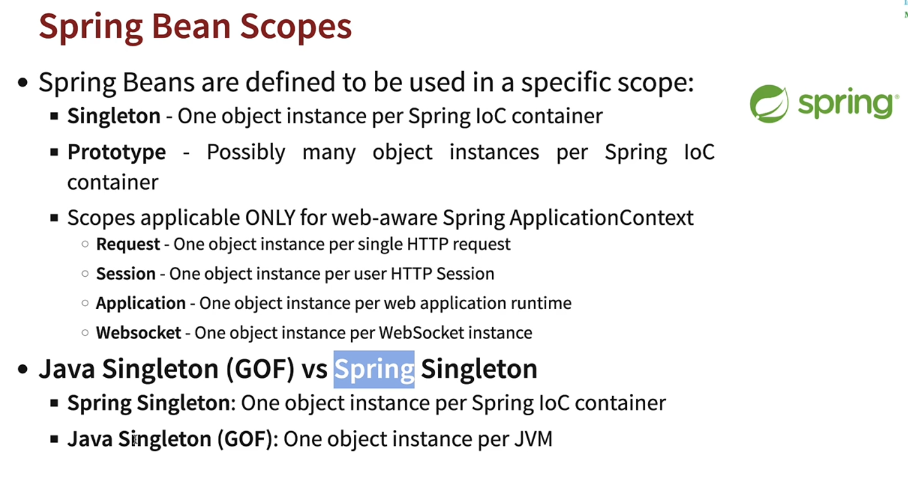

# 04 - Exploring Spring Framework Advanced Features

## 002 Step 01 - Exploring Lazy and Eager Initialization of Spring Framework Beans

let's create two classes `ClassA` and `ClassB` and `ClassB` will have a dependency on `ClassA` and we will see how we can control the initialization of these beans.

```java
package com.wchamara.learnspringframework.examples.a3;

import org.springframework.context.annotation.AnnotationConfigApplicationContext;
import org.springframework.context.annotation.ComponentScan;
import org.springframework.context.annotation.Configuration;
import org.springframework.context.annotation.Lazy;
import org.springframework.stereotype.Component;

import java.util.Arrays;

@Component
class ClassA {
}

@Component
class ClassB {

    private final ClassA classA;

    public ClassB(ClassA classA) {
        System.out.println("ClassB constructor");
        this.classA = classA;
    }

    public void doSomething() {
        System.out.println("ClassB doSomething");
    }
}


@Configuration
@ComponentScan
public class LazyAppLauncherApplication {

    public static void main(String[] args) {
        try (AnnotationConfigApplicationContext context = new AnnotationConfigApplicationContext(
                LazyAppLauncherApplication.class);
        ) {
//            Arrays.stream(context.getBeanDefinitionNames()).forEach(System.out::println);
//            ClassB classB = context.getBean(ClassB.class);
//            classB.doSomething();
        }
    }

}

```

let's run the application and see the output.

```shell
examples.a3.LazyAppLauncherApplication
ClassB constructor

Process finished with exit code 0
```

as you can see ClassB is not used it has been initialized by spring.

the default behavior of spring is to initialize all the beans eagerly. but we can change this behavior by using `@Lazy` annotation.

```java
package com.wchamara.learnspringframework.examples.a3;

import org.springframework.context.annotation.AnnotationConfigApplicationContext;
import org.springframework.context.annotation.ComponentScan;
import org.springframework.context.annotation.Configuration;
import org.springframework.context.annotation.Lazy;
import org.springframework.stereotype.Component;

import java.util.Arrays;

@Component
class ClassA {
}

@Component
@Lazy
class ClassB {

    private final ClassA classA;

    public ClassB(ClassA classA) {
        System.out.println("ClassB constructor");
        this.classA = classA;
    }

    public void doSomething() {
        System.out.println("ClassB doSomething");
    }
}


@Configuration
@ComponentScan
public class LazyAppLauncherApplication {

    public static void main(String[] args) {
        try (AnnotationConfigApplicationContext context = new AnnotationConfigApplicationContext(
                LazyAppLauncherApplication.class);
        ) {
//            Arrays.stream(context.getBeanDefinitionNames()).forEach(System.out::println);
//            ClassB classB = context.getBean(ClassB.class);
//            classB.doSomething();
        }
    }

}

```

```shell

Process finished with exit code 0
```

now we can see the initialization of `ClassB` is not happening.

let's use `ClassB` and see

```java
    public static void main(String[] args) {
        try (AnnotationConfigApplicationContext context = new AnnotationConfigApplicationContext(
                LazyAppLauncherApplication.class);
        ) {
            Arrays.stream(context.getBeanDefinitionNames()).forEach(System.out::println);
            ClassB classB = context.getBean(ClassB.class);
            classB.doSomething();
        }
    }
```

```shell
org.springframework.context.annotation.internalConfigurationAnnotationProcessor
org.springframework.context.annotation.internalAutowiredAnnotationProcessor
org.springframework.context.annotation.internalCommonAnnotationProcessor
org.springframework.context.event.internalEventListenerProcessor
org.springframework.context.event.internalEventListenerFactory
lazyAppLauncherApplication
classA
classB
ClassB constructor
ClassB doSomething
```

as you can see `ClassB` is initialized when we use it.


## 003 Step 02 - Comparing Lazy Initialization vs Eager Initialization


## 004 Step 03 - Exploring Java Spring Framework Bean Scopes - Prototype and Singleton

```java
package com.wchamara.learnspringframework.examples.a4;

import org.springframework.beans.factory.config.ConfigurableBeanFactory;
import org.springframework.context.annotation.AnnotationConfigApplicationContext;
import org.springframework.context.annotation.ComponentScan;
import org.springframework.context.annotation.Configuration;
import org.springframework.context.annotation.Scope;
import org.springframework.stereotype.Component;

@Component
class NormalClass {
}

@Component
@Scope(value = ConfigurableBeanFactory.SCOPE_PROTOTYPE)
class ScopedClass {
}


@Configuration
@ComponentScan
public class ScopeAppLauncherApplication {

    public static void main(String[] args) {
        try (AnnotationConfigApplicationContext context = new AnnotationConfigApplicationContext(
                ScopeAppLauncherApplication.class);
        ) {
            System.out.println(context.getBean(NormalClass.class));
            System.out.println(context.getBean(NormalClass.class));
            System.out.println(context.getBean(NormalClass.class));
            System.out.println(context.getBean(NormalClass.class));

            System.out.println(context.getBean(ScopedClass.class));
            System.out.println(context.getBean(ScopedClass.class));
            System.out.println(context.getBean(ScopedClass.class));
            System.out.println(context.getBean(ScopedClass.class));
            System.out.println(context.getBean(ScopedClass.class));

        }
    }

}

```

```shell
com.wchamara.learnspringframework.examples.a4.NormalClass@581ac8a8
com.wchamara.learnspringframework.examples.a4.NormalClass@581ac8a8
com.wchamara.learnspringframework.examples.a4.NormalClass@581ac8a8
com.wchamara.learnspringframework.examples.a4.NormalClass@581ac8a8
com.wchamara.learnspringframework.examples.a4.ScopedClass@6d4e5011
com.wchamara.learnspringframework.examples.a4.ScopedClass@57d7f8ca
com.wchamara.learnspringframework.examples.a4.ScopedClass@76c3e77a
com.wchamara.learnspringframework.examples.a4.ScopedClass@78123e82
com.wchamara.learnspringframework.examples.a4.ScopedClass@67c33749
```



## 005 Step 04 - Comparing Prototype vs Singleton - Spring Framework Bean Scopes

## 006 Step 05 - Exploring Spring Beans - PostConstruct and PreDestroy

## 007 Step 06 - Evolution of Jakarta EE - Comparing with J2EE and Java EE

## 008 Step 07 - Exploring Jakarta CDI with Spring Framework and Java

## 010 Step 08 - Exploring Java Spring XML Configuration

## 011 Step 09 - Explore Java Annotations vs XML Configuration - Java Spring Framework

## 012 Step 10 - Exploring Spring Framework Stereotype Annotations - Component and more

## 013 Step 11 - Quick Review - Important Spring Framework Annotations

## 014 Step 12 - Quick Review - Important Spring Framework Concepts

## 015 Step 13 - Exploring Spring Big Picture - Framework, Modules and Projects
