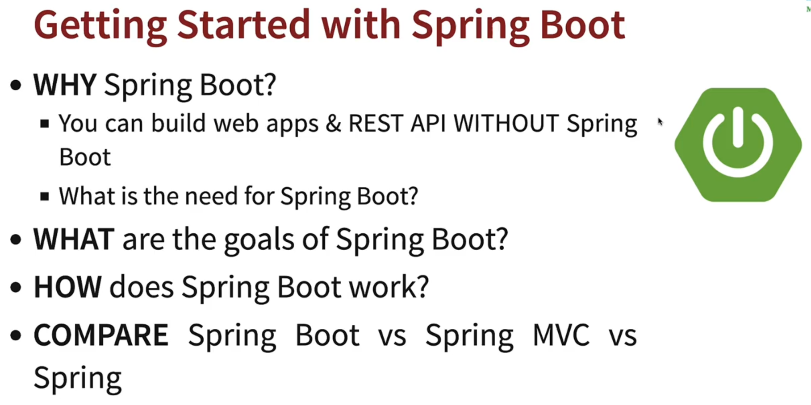
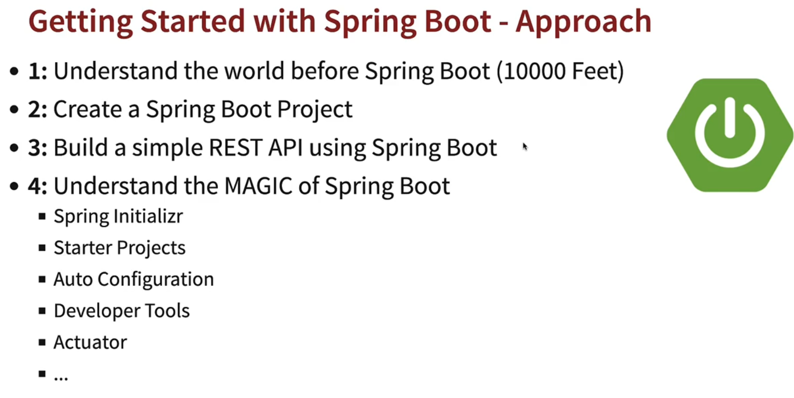
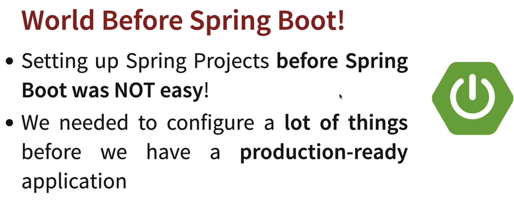
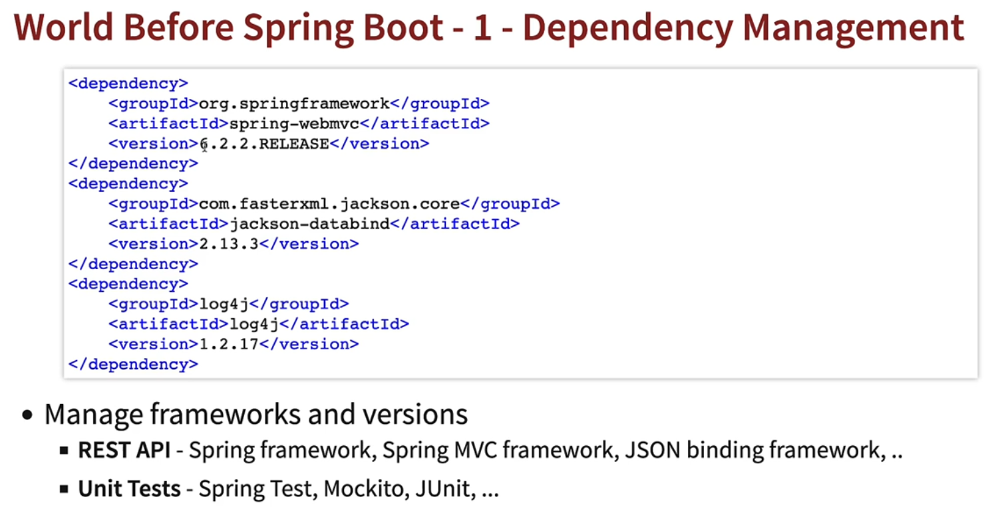
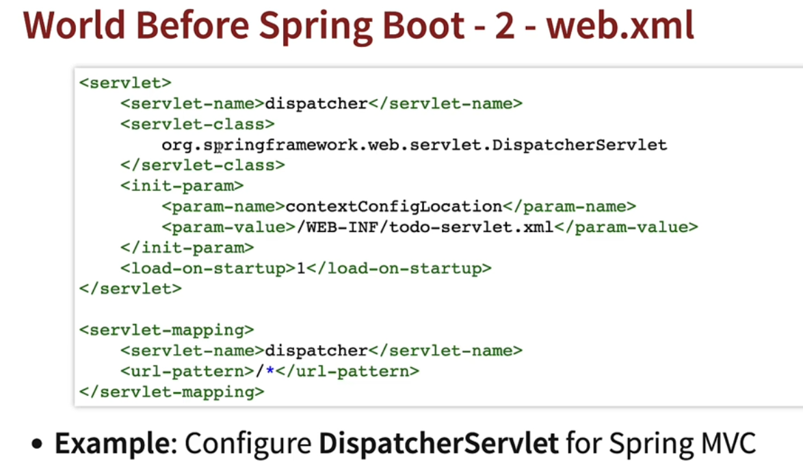
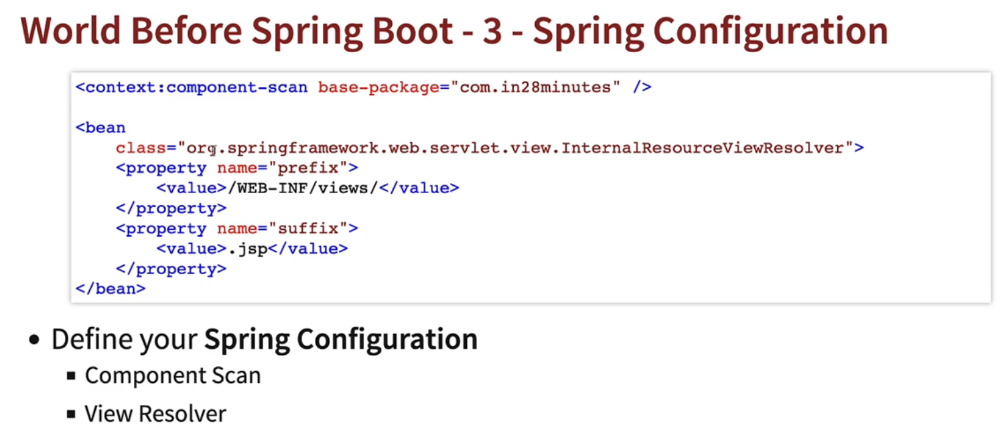
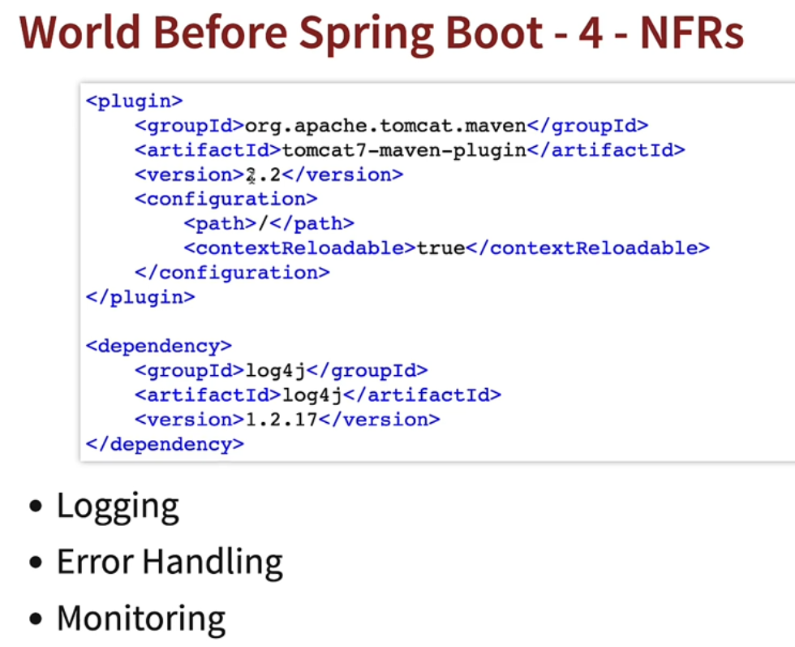
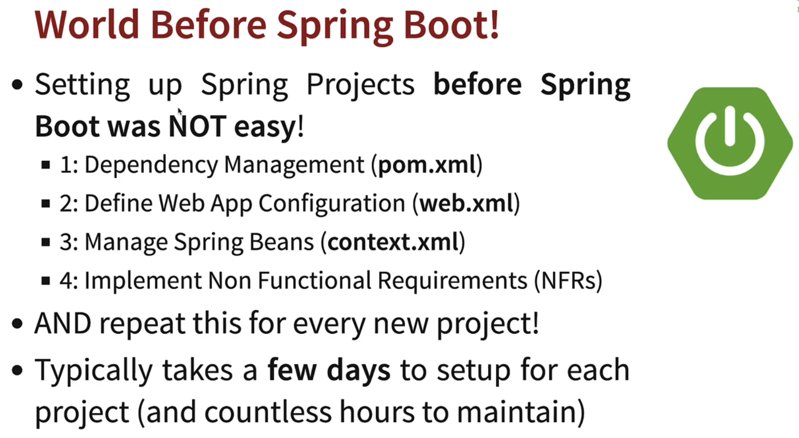
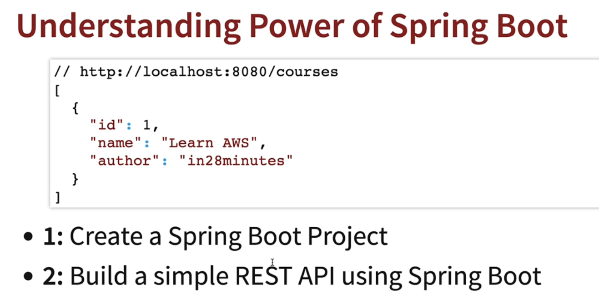

# 05---Getting-Started-with-Spring-Boot

## 002 Step 01 - Getting Started with Spring Boot - Goals

## 003 Step 02 - Understanding the World Before Spring Boot - 10000 Feet Overview

## 004 Step 03 - Setting up New Spring Boot Project with Spring Initializr

## 005 Step 04 - Build a Hello World API with Spring Boot

## 006 Step 05 - Understanding the Goal of Spring Boot

## 007 Step 06 - Understanding Spring Boot Magic - Spring Boot Starter Projects

## 008 Step 07 - Understanding Spring Boot Magic - Auto Configuration

## 009 Step 08 - Build Faster with Spring Boot DevTools

## 010 Step 09 - Get Production Ready with Spring Boot - 1 - Profiles

## 011 Step 10 - Get Production Ready with Spring Boot - 2 - ConfigurationProperties

## 012 Step 11 - Get Production Ready with Spring Boot - 3 - Embedded Servers

## 013 Step 12 - Get Production Ready with Spring Boot - 4 - Actuator

## 014 Step 13 - Understanding Spring Boot vs Spring vs Spring MVC

## 015 Step 14 - Getting Started with Spring Boot - Review
