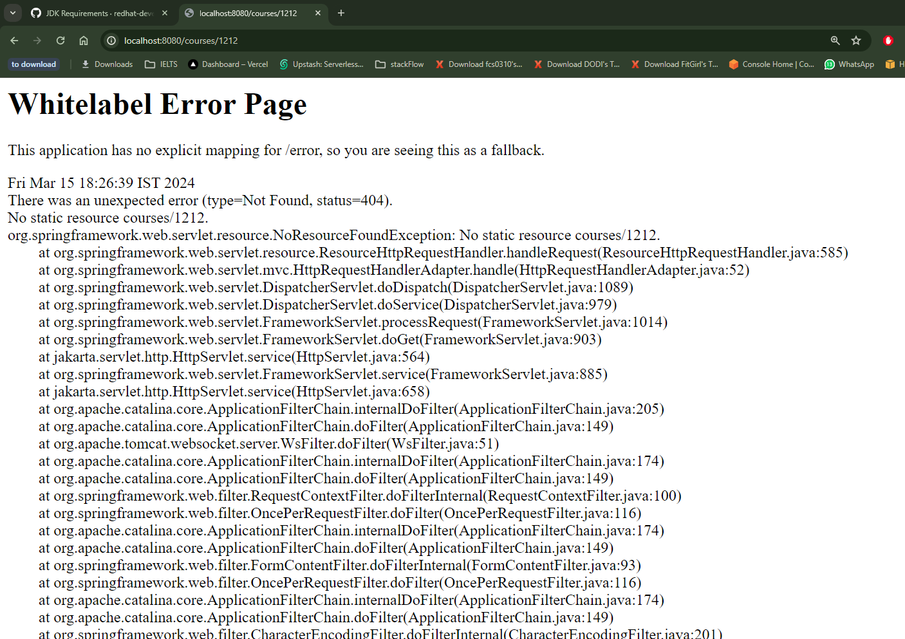
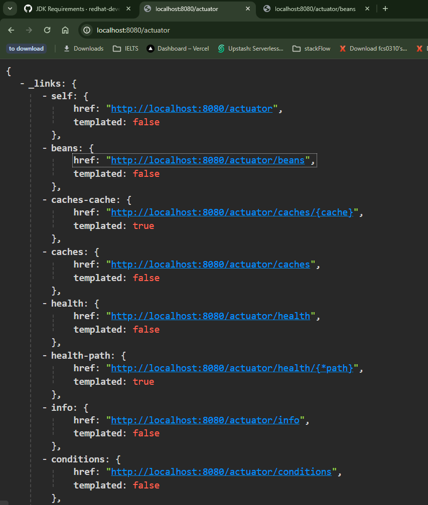

# 05---Getting-Started-with-Spring-Boot

## 002 Step 01 - Getting Started with Spring Boot - Goals


## 003 Step 02 - Understanding the World Before Spring Boot - 10000 Feet Overview


## 004 Step 03 - Setting up New Spring Boot Project with Spring Initializr


```xml
<?xml version="1.0" encoding="UTF-8"?>
<project xmlns="http://maven.apache.org/POM/4.0.0" xmlns:xsi="http://www.w3.org/2001/XMLSchema-instance"
 xsi:schemaLocation="http://maven.apache.org/POM/4.0.0 https://maven.apache.org/xsd/maven-4.0.0.xsd">
 <modelVersion>4.0.0</modelVersion>
 <parent>
  <groupId>org.springframework.boot</groupId>
  <artifactId>spring-boot-starter-parent</artifactId>
  <version>3.2.3</version>
  <relativePath/> <!-- lookup parent from repository -->
 </parent>
 <groupId>com.wchamara</groupId>
 <artifactId>learn-spring-boot</artifactId>
 <version>0.0.1-SNAPSHOT</version>
 <name>learn-spring-boot</name>
 <description>Demo project for Spring Boot</description>
 <properties>
  <java.version>21</java.version>
 </properties>
 <dependencies>
  <dependency>
   <groupId>org.springframework.boot</groupId>
   <artifactId>spring-boot-starter-web</artifactId>
  </dependency>

  <dependency>
   <groupId>org.springframework.boot</groupId>
   <artifactId>spring-boot-devtools</artifactId>
   <scope>runtime</scope>
   <optional>true</optional>
  </dependency>
  <dependency>
   <groupId>org.springframework.boot</groupId>
   <artifactId>spring-boot-starter-test</artifactId>
   <scope>test</scope>
  </dependency>
 </dependencies>

 <build>
  <plugins>
   <plugin>
    <groupId>org.springframework.boot</groupId>
    <artifactId>spring-boot-maven-plugin</artifactId>
   </plugin>
  </plugins>
 </build>

</project>

```

you can create a new project using Spring Initializr at [https://start.spring.io/](https://start.spring.io/)

```shell
mvn clean install
```

```shell
mvn spring-boot:run
```

```shell
java -jar target/learn-spring-boot-0.0.1-SNAPSHOT.jar
```


## 005 Step 04 - Build a Hello World API with Spring Boot


```java
package com.wchamara.learnspringboot;

import org.springframework.web.bind.annotation.RequestMapping;
import org.springframework.web.bind.annotation.RestController;

import java.util.Arrays;
import java.util.List;

@RestController
public class CourseController {
    @RequestMapping("/courses")
    public List<Course> getAllCourses() {
        return Arrays.asList(
            new Course("Spring", "Spring Framework", "Spring Framework Description"),
            new Course("Java", "Core Java", "Core Java Description"),
            new Course("JavaScript", "JavaScript", "JavaScript Description")
        );
    }
}

```

```java
package com.wchamara.learnspringboot;

import org.springframework.stereotype.Component;


public class Course {
    private String name;
    private String description;
    private String topic;

    public Course(String name, String description, String topic) {
        this.name = name;
        this.description = description;
        this.topic = topic;
    }

    public String getName() {
        return name;
    }

    public void setName(String name) {
        this.name = name;
    }

    public String getDescription() {
        return description;
    }

    public void setDescription(String description) {
        this.description = description;
    }

    public String getTopic() {
        return topic;
    }

    public void setTopic(String topic) {
        this.topic = topic;
    }

    @Override
    public String toString() {
        return "Course{" +
                "name='" + name + '\'' +
                ", description='" + description + '\'' +
                ", topic='" + topic + '\'' +
                '}';
    }
}

```


## 006 Step 05 - Understanding the Goal of Spring Boot


## 007 Step 06 - Understanding Spring Boot Magic - Spring Boot Starter Projects


## 008 Step 07 - Understanding Spring Boot Magic - Auto Configuration




we can set the logging level in the `application.yml` file

```yml
spring:
  application:
    name: learn-spring-boot

logging:
  level:
    org:
      springframework: debug
```

## 009 Step 08 - Build Faster with Spring Boot DevTools


```xml
  <dependency>
   <groupId>org.springframework.boot</groupId>
   <artifactId>spring-boot-devtools</artifactId>
   <scope>runtime</scope>
   <optional>true</optional>
  </dependency>
```

## 010 Step 09 - Get Production Ready with Spring Boot - 1 - Profiles


let's createa dev profile yml file `application-dev.yml` and `application-prod.yml`

```yml
spring:
  application:
    name: learn-spring-boot

logging:
  level:
    org:
      springframework: debug
```

```yml
spring:
  application:
    name: learn-spring-boot

logging:
  level:
    org:
      springframework: info
```

let's set the active profile in the `application.yml` file

```yml
spring:
  profiles:
    active: prod
  application:
    name: learn-spring-boot

logging:
  level:
    org:
      springframework: debug
```

## 011 Step 10 - Get Production Ready with Spring Boot - 2 - ConfigurationProperties

let's use @ConfigurationProperties to map the properties in the `application.yml` file to a class

```yml
spring:
  profiles:
    active: dev
  application:
    name: learn-spring-boot

logging:
  level:
    org:
      springframework: debug

currency-service:
  url: http://localhost:8000
  username: user
  password: password

```

prod

```yml
spring:
  application:
    name: learn-spring-boot

logging:
  level:
    org:
      springframework: debug

currency-service:
  url: http://dev.currency-service.com
  username: devuser
  password: devpassword
```

dev

```yml
spring:
  application:
    name: learn-spring-boot

logging:
  level:
    org:
      springframework: info

currency-service:
  url: http://prod.currency-service.com
  username: produser
  password: prodpassword
```

```java
package com.wchamara.learnspringboot;

import org.springframework.boot.context.properties.ConfigurationProperties;
import org.springframework.stereotype.Component;

@ConfigurationProperties(prefix = "currency-service")
@Component
public class CurrencyConfiguration {
    private String url;
    private String username;
    private String password;

    public String getUrl() {
        return url;
    }

    public void setUrl(String url) {
        this.url = url;
    }

    public String getUsername() {
        return username;
    }

    public void setUsername(String username) {
        this.username = username;
    }

    public String getPassword() {
        return password;
    }

    public void setPassword(String password) {
        this.password = password;
    }
}
```

```java
package com.wchamara.learnspringboot;

import org.springframework.beans.factory.annotation.Autowired;
import org.springframework.web.bind.annotation.RequestMapping;
import org.springframework.web.bind.annotation.RestController;

@RestController
public class CurrencyController {
    @Autowired
    private CurrencyConfiguration currencyConfiguration;

    @RequestMapping("/currency")
    public CurrencyConfiguration getAllCourses() {

        return currencyConfiguration;
    }
}

```


## 012 Step 11 - Get Production Ready with Spring Boot - 3 - Embedded Servers

since we are using spring boot, we don't need to add the embedded server dependency, it's already included in the spring boot starter web dependency

```xml
  <dependency>
   <groupId>org.springframework.boot</groupId>
   <artifactId>spring-boot-starter-web</artifactId>
  </dependency>
```

so all we need to do is build the project and run it

```shell
mvn clean install
```

```shell
java -jar target/learn-spring-boot-0.0.1-SNAPSHOT.jar
```


## 013 Step 12 - Get Production Ready with Spring Boot - 4 - Actuator

```xml
<dependency>
    <groupId>org.springframework.boot</groupId>
    <artifactId>spring-boot-starter-actuator</artifactId>
</dependency>
```




```yml
spring:
  profiles:
    active: dev
  application:
    name: learn-spring-boot

logging:
  level:
    org:
      springframework: debug

currency-service:
  url: http://localhost:8000
  username: user
  password: password

management:
  endpoints:
    web:
      exposure:
        include:
          - health
          - info
          - metrics
          - env
```

## 014 Step 13 - Understanding Spring Boot vs Spring vs Spring MVC


## 015 Step 14 - Getting Started with Spring Boot - Review


