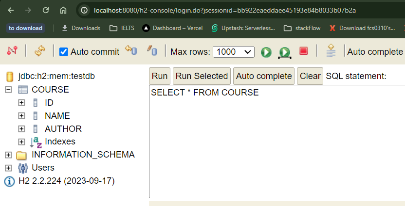

# 06---Getting-Started-with-JPA-and-Hibernate-with-Spring-and-Spring-Boot

## 002 Step 01 - Getting Started with JPA and Hibernate - Goals


## 003 Step 02 - Setting up New Spring Boot Project for JPA and Hibernate


## 004 Step 03 - Launching up H2 Console and Creating Course Table in H2

```yml
spring:
  application:
    name: learn-jpa-and-hibernate
  h2:
    console:
      enabled: true
  datasource:
    url: jdbc:h2:mem:testdb
```

`schemas.sql`

```sql
create table course
(
    id     bigint,
    name   varchar(255),
    author varchar(255),
    primary key (id)
);


select * from course;
```



## 005 Step 04 - Getting Started with Spring JDBC


## 006 Step 05 - Inserting Hardcoded Data using Spring JDBC

```java
package com.wchamara.learnjpaandhibernate.course.jdbc;

import org.springframework.beans.factory.annotation.Autowired;
import org.springframework.jdbc.core.JdbcTemplate;
import org.springframework.stereotype.Repository;

@Repository
public class CourseJdbcRepository {
    private static final String INSERT_SQL = """
    insert into course (id, name, author) VALUES(2, 'book1','wchamara');
    """;

    @Autowired
    private JdbcTemplate jdbcTemplate;

    public void insert(){
        jdbcTemplate.update(INSERT_SQL);
    }


}
```

```java
package com.wchamara.learnjpaandhibernate.course.jdbc;

import org.springframework.beans.factory.annotation.Autowired;
import org.springframework.boot.CommandLineRunner;
import org.springframework.stereotype.Component;

@Component
public class CourseJdbcCommandLineRunner implements CommandLineRunner {
    @Autowired
    private CourseJdbcRepository courseJdbcRepository;

    @Override
    public void run(String... args) throws Exception {
        System.out.println("✅✅✅✅✅✅✅✅✅✅✅✅✅ Inserting course via JDBC ✅✅✅✅✅✅✅✅✅✅✅✅✅✅✅✅");
        courseJdbcRepository.insert();
    }
}

```


## 007 Step 06 - Inserting and Deleting Data using Spring JDBC

```java
package com.wchamara.learnjpaandhibernate.course.jdbc;

import org.springframework.beans.factory.annotation.Autowired;
import org.springframework.jdbc.core.JdbcTemplate;
import org.springframework.stereotype.Repository;

@Repository
public class CourseJdbcRepository {
    private static final String INSERT_SQL = """
    insert into course (id, name, author) VALUES(2, 'book1','wchamara');
    """;

    @Autowired
    private JdbcTemplate jdbcTemplate;

    public void insert(){
        jdbcTemplate.update(INSERT_SQL);
    }

    public void insertOne(Course course){
        jdbcTemplate.update("insert into course (id, name, author) VALUES(?, ?, ?)", course.getId(), course.getName(), course.getAuthor());
    }

    public void deleteById(long id){
        jdbcTemplate.update("delete from course where id=?", id);
    }


}

```

```java
package com.wchamara.learnjpaandhibernate.course.jdbc;

public class Course {

    private long id;
    private String name;

    private String author;

    public long getId() {
        return id;
    }

    public void setId(long id) {
        this.id = id;
    }

    public Course() {
    }

    public Course(long id, String name, String author) {
        this.id = id;
        this.name = name;
        this.author = author;
    }

    public String getName() {
        return name;
    }

    public void setName(String name) {
        this.name = name;
    }

    public String getAuthor() {
        return author;
    }

    public void setAuthor(String author) {
        this.author = author;
    }
}

```

```java
package com.wchamara.learnjpaandhibernate.course.jdbc;

import org.springframework.beans.factory.annotation.Autowired;
import org.springframework.boot.CommandLineRunner;
import org.springframework.stereotype.Component;

@Component
public class CourseJdbcCommandLineRunner implements CommandLineRunner {
    @Autowired
    private CourseJdbcRepository courseJdbcRepository;

    @Override
    public void run(String... args) throws Exception {
        System.out.println("✅✅✅✅✅✅✅✅✅✅✅✅✅ Inserting course via JDBC ✅✅✅✅✅✅✅✅✅✅✅✅✅✅✅✅");
        courseJdbcRepository.insert();
        courseJdbcRepository.insertOne(new Course(3, "book3", "wchamara"));

        courseJdbcRepository.deleteById(1);
    }
}

```


## 008 Step 07 - Querying Data using Spring JDBC

```java
package com.wchamara.learnjpaandhibernate.course.jdbc;

import org.springframework.beans.factory.annotation.Autowired;
import org.springframework.jdbc.core.BeanPropertyRowMapper;
import org.springframework.jdbc.core.JdbcTemplate;
import org.springframework.stereotype.Repository;

@Repository
public class CourseJdbcRepository {
    private static final String INSERT_SQL = """
    insert into course (id, name, author) VALUES(2, 'book1','wchamara');
    """;

    @Autowired
    private JdbcTemplate jdbcTemplate;

    public void insert(){
        jdbcTemplate.update(INSERT_SQL);
    }

    public void insertOne(Course course){
        jdbcTemplate.update("insert into course (id, name, author) VALUES(?, ?, ?)", course.getId(), course.getName(), course.getAuthor());
    }

    public void deleteById(long id){
        jdbcTemplate.update("delete from course where id=?", id);
    }

    public Course findById(long id){
        return jdbcTemplate.queryForObject("select * from course where id=?", new BeanPropertyRowMapper<>(Course.class),id);
    }


}

```

```java
package com.wchamara.learnjpaandhibernate.course.jdbc;

import org.springframework.beans.factory.annotation.Autowired;
import org.springframework.boot.CommandLineRunner;
import org.springframework.stereotype.Component;

@Component
public class CourseJdbcCommandLineRunner implements CommandLineRunner {
    @Autowired
    private CourseJdbcRepository courseJdbcRepository;

    @Override
    public void run(String... args) throws Exception {
        System.out.println("✅✅✅✅✅✅✅✅✅✅✅✅✅ Inserting course via JDBC ✅✅✅✅✅✅✅✅✅✅✅✅✅✅✅✅");
        courseJdbcRepository.insert();
        courseJdbcRepository.insertOne(new Course(3, "book3", "wchamara"));

        courseJdbcRepository.deleteById(1);
        System.out.println("Course with id 1: " + courseJdbcRepository.findById(2));
    }
}

```

## 009 Step 08 - Getting Started with JPA and EntityManager

```java
package com.wchamara.learnjpaandhibernate.course.jdbc.jpa;

import com.wchamara.learnjpaandhibernate.course.jdbc.Course;
import jakarta.persistence.EntityManager;
import jakarta.persistence.PersistenceContext;
import jakarta.transaction.Transactional;
import org.springframework.stereotype.Repository;

@Repository
@Transactional
public class CourseJpaRepository {
    @PersistenceContext
    private EntityManager entityManager;

    public void insert(Course course){
        entityManager.merge(course);
    }

    public void insertOne(Course course){
        entityManager.merge(course);
    }

    public Course findById(long id){
        return entityManager.find(Course.class, id);
    }

    public void deleteById(long id){
        Course course = findById(id);
        entityManager.remove(course);
    }
}

```

```java
package com.wchamara.learnjpaandhibernate.course.jdbc;

import jakarta.persistence.Entity;
import jakarta.persistence.Id;

@Entity
public class Course {
    @Id
    private long id;
    private String name;

```

```java
package com.wchamara.learnjpaandhibernate.course.jdbc;

import com.wchamara.learnjpaandhibernate.course.jdbc.jpa.CourseJpaRepository;
import org.springframework.beans.factory.annotation.Autowired;
import org.springframework.boot.CommandLineRunner;
import org.springframework.stereotype.Component;

@Component
public class CourseJdbcCommandLineRunner implements CommandLineRunner {
//    @Autowired
//    private CourseJdbcRepository courseJdbcRepository;
    @Autowired
    private CourseJpaRepository repository;
    @Override
    public void run(String... args) throws Exception {
//        repository.insert();
        repository.insertOne(new Course(3, "book3", "wchamara"));
//
//        repository.deleteById(1);
//        System.out.println("Course with id 1: " + repository.findById(2));
    }
}

```

```yml
spring:
  application:
    name: learn-jpa-and-hibernate
  h2:
    console:
      enabled: true
  datasource:
    url: jdbc:h2:mem:testdb
  jpa:
    show-sql: true

```


## 010 Step 09 - Exploring the Magic of JPA


## 011 Step 10 - Getting Started with Spring Data JPA


```java
package com.wchamara.learnjpaandhibernate.course.springjpa;

import com.wchamara.learnjpaandhibernate.course.Course;
import org.springframework.data.jpa.repository.JpaRepository;


public interface CourseSpringJpaRepository extends JpaRepository<Course, Long> {

}

```

```java
package com.wchamara.learnjpaandhibernate.course.jdbc;

import com.wchamara.learnjpaandhibernate.course.springjpa.CourseSpringJpaRepository;
import com.wchamara.learnjpaandhibernate.course.Course;
import org.springframework.beans.factory.annotation.Autowired;
import org.springframework.boot.CommandLineRunner;
import org.springframework.stereotype.Component;

@Component
public class CourseJdbcCommandLineRunner implements CommandLineRunner {

    @Autowired
    private CourseSpringJpaRepository repository;
    @Override
    public void run(String... args) throws Exception {
    Course course = new Course(1, "book1", "wchamara");
    Course course2 = new Course(2, "book2", "wchamara");
    Course course3 = new Course(3, "book3", "wchamara");
    repository.save(course);
    repository.save(course2);
    repository.save(course3);

    repository.deleteById(1L);

    System.out.println("Course with id 1: " + repository.findById(1L));
    System.out.println("Course with id 2: " + repository.findById(2L));
    }
}

```


## 012 Step 11 - Exploring features of Spring Data JPA

```java
package com.wchamara.learnjpaandhibernate.course.springjpa;

import com.wchamara.learnjpaandhibernate.course.Course;
import org.springframework.data.jpa.repository.JpaRepository;

import java.util.List;


public interface CourseSpringJpaRepository extends JpaRepository<Course, Long> {
    List<com.wchamara.learnjpaandhibernate.course.Course> findByAuthor(String author);
}

```

```java
package com.wchamara.learnjpaandhibernate.course.jdbc;

import com.wchamara.learnjpaandhibernate.course.Course;
import com.wchamara.learnjpaandhibernate.course.springjpa.CourseSpringJpaRepository;
import org.springframework.beans.factory.annotation.Autowired;
import org.springframework.boot.CommandLineRunner;
import org.springframework.stereotype.Component;

@Component
public class CourseJdbcCommandLineRunner implements CommandLineRunner {
    //    @Autowired
//    private CourseJdbcRepository courseJdbcRepository;
    @Autowired
    private CourseSpringJpaRepository repository;

    @Override
    public void run(String... args) throws Exception {
        Course course = new Course(1, "book1", "wchamara");
        Course course2 = new Course(2, "book2", "wchamara");
        Course course3 = new Course(3, "book3", "wchamara");
        repository.save(course);
        repository.save(course2);
        repository.save(course3);

        repository.deleteById(1L);

        System.out.println("Course with id 1: " + repository.findById(1L));
        System.out.println("Course with id 2: " + repository.findById(2L));

        System.out.println(repository.findByAuthor("wchamara"));

        //        repository.deleteById(1);
//        System.out.println("Course with id 1: " + repository.findById(2));
    }
}

```


## 013 Step 12 - Understanding difference between Hibernate and JPA


