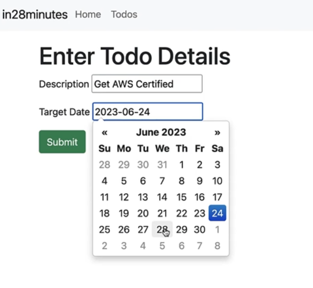
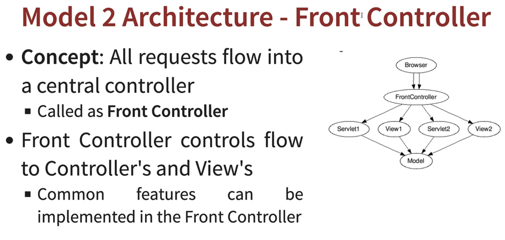

# 07---Build-Java-Web-Application-with-Spring-Framework,-Spring-Boot-and-Hibernate

## 002 Step 00 - Introduction to Building Web App with Spring Boot





## 003 Step 01 - Creating Spring Boot Web Application with Spring Initializr

use [Spring Initializr](https://start.spring.io/)

project: `Web`,`devtools` dependencies

## 004 Step 02 - Quick overview of Spring Boot Project

```yml
spring:
  application:
    name: myfirstwebapp
```


```xml
<?xml version="1.0" encoding="UTF-8"?>
<project xmlns="http://maven.apache.org/POM/4.0.0" xmlns:xsi="http://www.w3.org/2001/XMLSchema-instance"
 xsi:schemaLocation="http://maven.apache.org/POM/4.0.0 https://maven.apache.org/xsd/maven-4.0.0.xsd">
 <modelVersion>4.0.0</modelVersion>
 <parent>
  <groupId>org.springframework.boot</groupId>
  <artifactId>spring-boot-starter-parent</artifactId>
  <version>3.2.3</version>
  <relativePath/> <!-- lookup parent from repository -->
 </parent>
 <groupId>com.wchamara</groupId>
 <artifactId>myfirstwebapp</artifactId>
 <version>0.0.1-SNAPSHOT</version>
 <name>myfirstwebapp</name>
 <description>Demo project for Spring Boot</description>
 <properties>
  <java.version>21</java.version>
 </properties>
 <dependencies>
  <dependency>
   <groupId>org.springframework.boot</groupId>
   <artifactId>spring-boot-starter-web</artifactId>
  </dependency>

  <dependency>
   <groupId>org.springframework.boot</groupId>
   <artifactId>spring-boot-devtools</artifactId>
   <scope>runtime</scope>
   <optional>true</optional>
  </dependency>
  <dependency>
   <groupId>org.springframework.boot</groupId>
   <artifactId>spring-boot-starter-test</artifactId>
   <scope>test</scope>
  </dependency>
 </dependencies>

 <build>
  <plugins>
   <plugin>
    <groupId>org.springframework.boot</groupId>
    <artifactId>spring-boot-maven-plugin</artifactId>
   </plugin>
  </plugins>
 </build>

</project>
```

## 005 Step 03 - First Spring MVC Controller, @ResponseBody, @Controller

```java
package com.wchamara.myfirstwebapp.hello;

import org.springframework.stereotype.Controller;
import org.springframework.web.bind.annotation.GetMapping;
import org.springframework.web.bind.annotation.RequestMapping;
import org.springframework.web.bind.annotation.ResponseBody;

@Controller
public class SayHelloController {
    @RequestMapping("/say-hello")
    @ResponseBody
    public String sayHello() {
        return "Hello, World!";
    }
}
```

This code is written in Java and uses the Spring Framework, a popular framework for building web applications in Java. The code defines a controller class, SayHelloController, which is responsible for handling incoming web requests.

The @Controller annotation at the top of the class declaration is a special marker, telling Spring that this class should be treated as a controller. Controllers in Spring are components that handle HTTP requests and responses.

Inside the SayHelloController class, there's a method named sayHello(). This method is annotated with @RequestMapping("/say-hello"), which tells Spring that this method should be invoked whenever there's an HTTP request to the "/say-hello" URL path.

The @ResponseBody annotation indicates that the return value of the method should be sent straight to the HTTP response body. In other words, whatever string this method returns will be what the client (e.g., a web browser) receives.

The sayHello() method itself is quite simple: it just returns the string "Hello, World!". So, when a client sends a request to "/say-hello", they will receive a response with "Hello, World!" as the body.

In summary, this code sets up a simple web server that responds with "Hello, World!" when it receives a request at the "/say-hello" URL.

## 006 Step 04 - 01 - Enhancing Spring MVC Controller to provide HTML response

```java
package com.wchamara.myfirstwebapp.hello;

import org.springframework.stereotype.Controller;
import org.springframework.web.bind.annotation.RequestMapping;
import org.springframework.web.bind.annotation.ResponseBody;

@Controller
public class SayHelloController {
    @RequestMapping("/say-hello")
    @ResponseBody
    public String sayHello() {
        return "Hello, World!";
    }

    @RequestMapping("/say-hello-in-html")
    @ResponseBody
    public String sayHelloInHTML() {

        StringBuffer html = new StringBuffer();
        html.append("<html>");
        html.append("<head>");
        html.append("<title>Home</title>");
        html.append("</head>");
        html.append("<body>");
        html.append("<h1>Home</h1>");
        html.append("<p>Welcome to the home page updated</p>");
        html.append("<a href=\"about.php\">About</a>");
        html.append("<a href=\"contact.php\">Contact</a>");
        html.append("</body>");
        html.append("</html>");


        return html.toString();
    }
}
```

The provided code is a method named sayHelloInHTML() in a Spring controller class. This method is designed to handle HTTP requests directed to the "/say-hello-in-html" URL path, as indicated by the @RequestMapping("/say-hello-in-html") annotation.

The @ResponseBody annotation tells Spring that the return value of this method should be sent directly to the HTTP response body. This means that the HTML code generated by this method will be sent to the client's browser for rendering.

Inside the sayHelloInHTML() method, a StringBuffer named html is created. StringBuffer is a thread-safe, mutable sequence of characters. It's used here to build an HTML document as a string.

The append() method of StringBuffer is used to add HTML tags and content to the html object. The HTML document constructed here includes a head section with a title, a body section with a heading, a paragraph, and two links.

Finally, the toString() method is called on the html object to convert the StringBuffer to a String. This string, which represents an entire HTML document, is returned by the sayHelloInHTML() method. When a client sends a request to "/say-hello-in-html", they will receive this HTML document as the response.

## 007 Step 04 - 02 - Exploring Step By Step Coding and Debugging Guide

```xml
<dependency>
    <groupId>org.apache.tomcat.embed</groupId>
    <artifactId>tomcat-embed-jasper</artifactId>
</dependency>
```

In this specific selection, a dependency for tomcat-embed-jasper is declared. This is a library provided by Apache Tomcat, which is an open-source implementation of the Java Servlet, JavaServer Pages, Java Expression Language, and Java WebSocket technologies.

The tomcat-embed-jasper artifact provides the Jasper 2 JSP (JavaServer Pages) engine, which is used to compile JSPs into servlets. This dependency is typically included when you want to enable JSP support in an embedded Tomcat server.

The groupId represents the project's group, artifactId is the name of the jar without version, and the version (not shown in the selection) would represent the version of the artifact.

## 009 Step 05 - Redirect to a JSP using Spring Boot - Controller, @ResponseBody & View

```java
package com.wchamara.myfirstwebapp.hello;

import org.springframework.stereotype.Controller;
import org.springframework.web.bind.annotation.RequestMapping;
import org.springframework.web.bind.annotation.ResponseBody;

@Controller
public class SayHelloController {
    @RequestMapping("/say-hello")
    @ResponseBody
    public String sayHello() {
        return "Hello, World!";
    }

    @RequestMapping("/say-hello-in-html")
    @ResponseBody
    public String sayHelloInHTML() {

        StringBuffer html = new StringBuffer();
        html.append("<html>");
        html.append("<head>");
        html.append("<title>Home</title>");
        html.append("</head>");
        html.append("<body>");
        html.append("<h1>Home</h1>");
        html.append("<p>Welcome to the home page updated</p>");
        html.append("<a href=\"about.php\">About</a>");
        html.append("<a href=\"contact.php\">Contact</a>");
        html.append("</body>");
        html.append("</html>");


        return html.toString();
    }

    /**
         * Handles the request for "/say-hello-jsp" and returns the name of the JSP file to render.
         *
         * @return The name of the JSP file to render ("sayHello").
         */
        @RequestMapping("/say-hello-jsp")
        public String sayHelloJsp() {
            return "sayHello";
        }
}
```


```jsp
<html>
<head>
    <title>Home</title>
</head>
<body>
<h1>Home of JSP</h1>
<p>Welcome to the home page</p>
<a href="about.php">About</a>
<a href="contact.php">Contact</a>
</body>
</html>

```

```yml
spring:
  application:
    name: myfirstwebapp
  mvc:
    view:
      prefix: /WEB-INF/jsp/
      suffix: .jsp
logging:
  level:
    org:
      springframework:
        web: DEBUG

```

The prefix property is set to /WEB-INF/jsp/. This tells the view resolver that the JSP files are located in the /WEB-INF/jsp/ directory of the application.

The suffix property is set to .jsp. This tells the view resolver that the files it should look for will have names ending with .jsp.

So, for example, if a controller method returns a view name of home, the view resolver will look for a file named /WEB-INF/jsp/home.jsp to render as the view.

his configuration is used to set the logging level for classes in the org.springframework.web package to DEBUG. The logging level controls the amount of detail provided in the application's log output.

In the hierarchy of logging levels, DEBUG is one level below INFO, meaning it includes all INFO messages plus additional more detailed messages useful for debugging. The levels from least to most detailed are OFF, FATAL, ERROR, WARN, INFO, DEBUG, and TRACE.

By setting the logging level to DEBUG for org.springframework.web, you're asking Spring Boot to output more detailed log messages for classes in this package, which can be helpful for troubleshooting issues related to Spring's web functionality.

```xml
<dependency>
    <groupId>org.apache.tomcat.embed</groupId>
    <artifactId>tomcat-embed-jasper</artifactId>
</dependency>
```

The tomcat-embed-jasper library is a part of Apache Tomcat, an open-source implementation of the Java Servlet, JavaServer Pages, Java Expression Language, and Java WebSocket technologies. This library provides the Jasper 2 JSP (JavaServer Pages) engine, which is used to compile JSPs into servlets. This dependency is typically included when you want to enable JSP support in an embedded Tomcat server.

Note that this snippet does not include a version element, which is typically used to specify the version of the dependency that the project should use. If the version element is not included, Maven will use the latest version of the dependency that is available in the repositories it has access to.

## 010 Step 06 - Exercise - Creating LoginController and login view

```jsp
<html>
<head>
    <title>Login</title>
</head>
<body>
<form action="login.php" method="post">
    <input type="text" name="username" placeholder="Username" required>
    <input type="password" name="password" placeholder="Password" required>
    <input type="submit" value="Login">
</form>
<a href="register.php">Register</a>
<a href="forgot.php">Forgot Password</a>
</body>
</html>
```

```java
package com.wchamara.myfirstwebapp.login;

import org.springframework.stereotype.Controller;
import org.springframework.web.bind.annotation.RequestMapping;

@Controller
public class LoginController {


    @RequestMapping("/login")
    public String login() {
        return "login";
    }
}
```

## 011 Step 07 - Quick Overview - How does web work - Request and Response


## 012 Step 08 - Capturing QueryParams using RequestParam and First Look at Model

```java
package com.wchamara.myfirstwebapp.login;

import org.springframework.stereotype.Controller;
import org.springframework.ui.ModelMap;
import org.springframework.web.bind.annotation.RequestMapping;
import org.springframework.web.bind.annotation.RequestParam;

@Controller
public class LoginController {

    // http://localhost:8080/login?name=chamara
    @RequestMapping("/login")
    public String login(@RequestParam String name, ModelMap model) {
        model.put("name", name);
        return "login";
    }
}

```

The provided code is a Java class named LoginController, which is part of a Spring MVC web application. This class is located in the com.wchamara.myfirstwebapp.login package.

The @Controller annotation at the top of the class declaration indicates that this class is a controller in the Spring MVC framework. Controllers are responsible for processing incoming web requests and returning responses.

Inside the LoginController class, there's a method named login(). This method is annotated with @RequestMapping("/login"), which tells Spring MVC that this method should handle HTTP requests to the "/login" URL path.

The login() method takes two parameters: a String named name and a ModelMap named model. The @RequestParam annotation on the name parameter tells Spring MVC to bind the value of the "name" request parameter to this method parameter. For example, if the request URL is "<http://localhost:8080/login?name=chamara>", the name parameter will be set to "chamara".

The ModelMap parameter is used to pass attributes (data) to the view (the web page that is sent as the response). In this case, the name value is added to the ModelMap with the key "name".

Finally, the login() method returns the string "login". In the context of a Spring MVC controller, the returned string is typically the name of the view that should be rendered. So, this method is indicating that the "login" view should be used to generate the response. The "login" view will have access to the ModelMap and can use the "name" attribute to customize the response.

```jsp
<html>
<head>
    <title>Login</title>
</head>
<body>
<h1>Well come to the login page ${name}</h1>
</body>
</html>
```

The ${name} part is a placeholder that suggests this HTML is used as a template, and the ${name} part will be replaced with a dynamic value when the page is rendered. This is a common practice in server-side rendering, where a server generates a custom HTML page for each request. The server would replace ${name} with the actual value before sending the response to the client.

## 013 Step 09 - Quick Overview - Importance of Logging with Spring Boot


```yml
/**
 * This configuration sets the logging levels for different packages in the application.
 * 
 * - The `com.wchamara.myfirstwebapp` package is set to `debug` level, which means that detailed debug logs will be generated for this package.
 * - The `org.springframework.web` package is set to `info` level, which means that only informational logs will be generated for this package.
 * 
 * Adjusting the logging levels can help in debugging and monitoring the application's behavior.
 */
logging:
    level:
        com:
            wchamara:
                myfirstwebapp: debug
        org:
            springframework:
                web: info

```

```java
package com.wchamara.myfirstwebapp.login;

import org.slf4j.Logger;
import org.slf4j.LoggerFactory;
import org.springframework.stereotype.Controller;
import org.springframework.ui.ModelMap;
import org.springframework.web.bind.annotation.RequestMapping;
import org.springframework.web.bind.annotation.RequestParam;

@Controller
public class LoginController {
    private final Logger logger = LoggerFactory.getLogger(getClass());

    /**
     * Handles the login request and returns the login view.
     * 
     * @param name  the name parameter from the request
     * @param model the ModelMap object to hold the data for the view
     * @return the name of the login view
     */
    @RequestMapping("/login")
    public String login(@RequestParam String name, ModelMap model) {
        logger.info("name: {}", name);
        logger.warn("name: {}", name);
        logger.debug("name: {}", name);
        model.put("name", name);
        return "login";
    }
}
```


## 014 Step 10 - Understanding DispatcherServlet, Model 1, Model 2 and Front Controller





## 015 Step 11 - Creating a Login Form

```java
package com.wchamara.myfirstwebapp.login;

import org.springframework.stereotype.Controller;
import org.springframework.web.bind.annotation.RequestMapping;

@Controller
public class LoginController {

    // http://localhost:8080/login?name=chamara

    /**
     * Handles the "/login" request mapping.
     *
     * @return The name of the view to be rendered.
     */
    @RequestMapping("/login")
    public String login() {
        // Return the name of the view to be rendered.
        return "login";
    }
}
```

```html
<html>
<head>
    <title>Login</title>
</head>
<body>
<h1>Well come to the login page </h1>

<form action="" method="post">
    Name:<input type="text" name="name">
    Password:<input type="password" name="password">
    <input type="submit">
</form>
</body>
</html>
```

```
The HTML document starts with the <html> tag and ends with the </html> tag. Inside these tags, there are two main sections: the <head> and the <body>.

The <head> section contains meta-information about the HTML document that isn't displayed on the web page itself. In this case, it contains a <title> tag with the text "Login", which sets the title of the web page.

The <body> section contains the content that is displayed on the web page. Here, it includes an <h1> tag, which is used for the main heading on the page. The text inside the <h1> tag is "Well come to the login page".

The <body> section also contains a <form> element. This form is used to collect user input. The action attribute of the form is set to an empty string, which means the form will be submitted to the same URL that the page was loaded from. The method attribute is set to "post", which means the form data will be included in the body of the HTTP request when the form is submitted.

Inside the form, there are two <input> elements for the user to enter their name and password. The type attribute of the first input is set to "text", which means it's a text field. The name attribute is set to "name", which will be the key for this data in the form submission. The second input is similar, but its type is set to "password", which means the input will be masked for privacy. Its name attribute is set to "password".

Finally, there's another <input> element with type set to "submit". This creates a button that the user can click to submit the form. When the button is clicked, the form data (the name and password) will be sent to the server.
```


## 016 Step 12 - Displaying Login Credentials in a JSP using Model

```html
<html>
<head>
    <title>Welcome</title>
</head>
<body>
<h1>Well come</h1>
<h3>your name is ${name}</h3>
<h3>your password is ${password}</h3>
</body>
</html>
```

```java
/**
 * Handles the "/login" POST request mapping.
 *
 * @param name     The name parameter from the request.
 * @param password The password parameter from the request.
 * @param model    The ModelMap object used to pass attributes to the view.
 * @return         The name of the view to be rendered.
 */
@RequestMapping(value = "/login", method = RequestMethod.POST)
public String gotToWelcomePage(@RequestParam String name, @RequestParam String password, ModelMap model) {
    // Add the name and password attributes to the model.
    model.put("name", name);
    model.put("password", password);

    // Return the name of the view to be rendered.
    return "welcome";
}
```

## 017 Step 13 - Add hard coded validation of userid and password

```java
package com.wchamara.myfirstwebapp.login;

import com.wchamara.myfirstwebapp.authentication.AuthenticationService;
import org.springframework.stereotype.Controller;
import org.springframework.ui.ModelMap;
import org.springframework.web.bind.annotation.RequestMapping;
import org.springframework.web.bind.annotation.RequestMethod;
import org.springframework.web.bind.annotation.RequestParam;

@Controller
public class LoginController {

    private AuthenticationService authenticateService;

    public LoginController(AuthenticationService authenticateService) {
        this.authenticateService = authenticateService;
    }

    /**
     * Handles the "/login" request mapping.
     *
     * @return The name of the view to be rendered.
     */
    @RequestMapping(value = "/login", method = RequestMethod.GET)
    public String login() {
        // Return the name of the view to be rendered.
        return "login";
    }

    /**
     * Handles the "/login" POST request mapping.
     *
     * @param name     The name parameter from the request.
     * @param password The password parameter from the request.
     * @param model    The ModelMap object used to pass attributes to the view.
     * @return The name of the view to be rendered.
     */
    @RequestMapping(value = "/login", method = RequestMethod.POST)
    public String gotToWelcomePage(@RequestParam String name, @RequestParam String password, ModelMap model) {
        // Add the name and password attributes to the model.
        model.put("name", name);
        boolean isValidUser = authenticateService.authenticateUser(name, password);
        if (!isValidUser) {
            model.put("errorMessage", "Invalid Credentials");
            return "login";
        }
        // Return the name of the view to be rendered.
        return "welcome";
    }
}

```

```java
package com.wchamara.myfirstwebapp.authentication;

import org.springframework.stereotype.Service;

@Service
public class AuthenticationService {
    public boolean authenticateUser(String name, String password) {
        return name.equalsIgnoreCase("chamara") && password.equals("Sliit123!@#");
    }
}

```

```jsp
<html>
<head>
    <title>Welcome</title>
</head>
<body>
<h1>Well come</h1>

<h3>your name is ${name}</h3>
</body>
</html>
```

```jsp
<html>
<head>
    <title>Login</title>
</head>
<body>
<h1>Well come to the login page </h1>
<pre>${errorMessage}</pre>
<form action="" method="post">
    Name:<input type="text" name="name">
    Password:<input type="password" name="password">
    <input type="submit">
</form>
</body>
</html>
```

## 018 Step 14 - Getting started with Todo Features - Creating Todo and TodoService

```java
package com.wchamara.myfirstwebapp.todo;

import java.time.LocalDate;

public class Todo {

    private int id;
    private String username;
    private String description;

    private LocalDate targetDate;

    private boolean Done;

    public Todo(int id, String username, String description, LocalDate targetDate, boolean done) {
        this.id = id;
        this.username = username;
        this.description = description;
        this.targetDate = targetDate;
        Done = done;
    }

    public int getId() {
        return id;
    }

    public void setId(int id) {
        this.id = id;
    }

    public String getUsername() {
        return username;
    }

    public void setUsername(String username) {
        this.username = username;
    }

    public String getDescription() {
        return description;
    }

    public void setDescription(String description) {
        this.description = description;
    }

    public LocalDate getTargetDate() {
        return targetDate;
    }

    public void setTargetDate(LocalDate targetDate) {
        this.targetDate = targetDate;
    }

    public boolean isDone() {
        return Done;
    }

    public void setDone(boolean done) {
        Done = done;
    }
}

```

```java
package com.wchamara.myfirstwebapp.todo;

import java.time.LocalDate;
import java.util.ArrayList;
import java.util.List;

public class TodoService {
    private static final List<Todo> todos = new ArrayList<>();

    static {
        todos.add(new Todo(1, "chamara", "Learn Spring MVC", LocalDate.now().plusYears(1), false));
        todos.add(new Todo(2, "chamara", "Learn Spring", LocalDate.now().plusYears(2), false));
        todos.add(new Todo(3, "chamara", "Learn to Dance", LocalDate.now().plusYears(3), false));
    }

    public List<Todo> retrieveTodos() {
        return todos;
    }
}

```

## 019 Step 15 - Creating first version of List Todos Page

```java
package com.wchamara.myfirstwebapp.todo;

import java.time.LocalDate;
import java.util.ArrayList;
import java.util.List;

public class TodoService {
    private static final List<Todo> todos = new ArrayList<>();

    static {
        todos.add(new Todo(1, "chamara", "Learn Spring MVC", LocalDate.now().plusYears(1), false));
        todos.add(new Todo(2, "chamara", "Learn Spring", LocalDate.now().plusYears(2), false));
        todos.add(new Todo(3, "chamara", "Learn to Dance", LocalDate.now().plusYears(3), false));
    }

    public List<Todo> retrieveTodos() {
        return todos;
    }
}

```

```java
package com.wchamara.myfirstwebapp.todo;

import org.springframework.stereotype.Controller;
import org.springframework.ui.ModelMap;
import org.springframework.web.bind.annotation.RequestMapping;

import java.util.List;

@Controller
public class TodoController {

    private TodoService todoService;

    public TodoController(TodoService todoService) {
        this.todoService = todoService;
    }

    @RequestMapping(value = "/todos")
    public String getAllTodos(ModelMap model) {

        List<Todo> todos = todoService.retrieveTodos();

        model.put("todos", todos);
        return "todoList";
    }
}

```

```jsp
<html>
<head>
    <title>To Dos</title>
</head>
<body>
<h1>Well come</h1>

<h3>your todos are ${todos}</h3>
</body>
</html>
```

## 020 Step 16 - Understanding Session vs Model vs Request - @SessionAttributes

```jsp
<html>
<head>
    <title>Welcome</title>
</head>
<body>
<h1>Well come</h1>

<h3>your name is ${name}</h3>
<div>
    <a href="/todos">Manage My Todos</a>
</div>
</body>
</html>
```

```jsp
<html>
<head>
    <title>To Dos</title>
</head>
<body>
<h1>Well come</h1>
<h3>your name is ${name}</h3>
<h3>your todos are ${todos}</h3>
</body>
</html>
```

```java

package com.wchamara.myfirstwebapp.login;

import com.wchamara.myfirstwebapp.authentication.AuthenticationService;
import org.springframework.stereotype.Controller;
import org.springframework.ui.ModelMap;
import org.springframework.web.bind.annotation.RequestMapping;
import org.springframework.web.bind.annotation.RequestMethod;
import org.springframework.web.bind.annotation.RequestParam;
import org.springframework.web.bind.annotation.SessionAttributes;

@Controller
@SessionAttributes("name")
public class LoginController {

    private AuthenticationService authenticateService;

    public LoginController(AuthenticationService authenticateService) {
        this.authenticateService = authenticateService;
    }

    /**
     * Handles the "/login" request mapping.
     *
     * @return The name of the view to be rendered.
     */
    @RequestMapping(value = "/login", method = RequestMethod.GET)
    public String login() {
        // Return the name of the view to be rendered.
        return "login";
    }

    /**
     * Handles the "/login" POST request mapping.
     *
     * @param name     The name parameter from the request.
     * @param password The password parameter from the request.
     * @param model    The ModelMap object used to pass attributes to the view.
     * @return The name of the view to be rendered.
     */
    @RequestMapping(value = "/login", method = RequestMethod.POST)
    public String gotToWelcomePage(@RequestParam String name, @RequestParam String password, ModelMap model) {
        // Add the name and password attributes to the model.
        model.put("name", name);
        boolean isValidUser = authenticateService.authenticateUser(name, password);
        if (!isValidUser) {
            model.put("errorMessage", "Invalid Credentials");
            return "login";
        }
        // Return the name of the view to be rendered.
        return "welcome";
    }
}

```

```java
package com.wchamara.myfirstwebapp.todo;

import org.springframework.stereotype.Controller;
import org.springframework.ui.ModelMap;
import org.springframework.web.bind.annotation.RequestMapping;
import org.springframework.web.bind.annotation.SessionAttributes;

import java.util.List;

@Controller
@SessionAttributes("name")
public class TodoController {

    private TodoService todoService;

    public TodoController(TodoService todoService) {
        this.todoService = todoService;
    }

    @RequestMapping(value = "/todos")
    public String getAllTodos(ModelMap model) {

        List<Todo> todos = todoService.retrieveTodos();

        model.put("todos", todos);
        return "todoList";
    }
}

```


## 021 Step 17 - Adding JSTL to Spring Boot Project and Showing Todos in a Table


```xml
<dependency>
    <groupId>jakarta.servlet.jsp.jstl</groupId>
    <artifactId>jakarta.servlet.jsp.jstl-api</artifactId>
</dependency>
<dependency>
    <groupId>org.eclipse.jetty</groupId>
    <artifactId>glassfish-jstl</artifactId>
</dependency>
```

```jsp
<%@ taglib prefix="c" uri="http://java.sun.com/jsp/jstl/core" %>

<html>
<head>
    <title>To Dos</title>
</head>
<body>
<h1>Well come ${name}</h1>
<hr>
<table>
    <thead>
    <tr>
        <th>id</th>
        <th>name</th>
        <th>description</th>
        <th>target date</th>
        <th>done</th>
    </tr>
    </thead>
    <tbody>
    <c:forEach items="${todos}" var="todo">
        <tr>
            <td>${todo.id}</td>
            <td>${todo.username}</td>
            <td>${todo.description}</td>
            <td>${todo.targetDate}</td>
            <td>${todo.done}</td>
        </tr>
    </c:forEach>
    </tbody>
</table>
</body>
</html>
```


## 023 Step 18 - Adding Bootstrap CSS framework to Spring Boot Project using webjars

## 024 Step 19 - Formatting JSP pages with Bootstrap CSS framework

## 025 Step 20 - Lets Add a New Todo - Create a new View

## 026 Step 21 - Enhancing TodoService to add the todo

## 027 Step 22 - Adding Validations using Spring Boot Starter Validation

## 028 Step 23 - Using Command Beans to implement New Todo Page Validations

## 029 Step 24 - Implementing Delete Todo Feature - New View

## 030 Step 25 - Implementing Update Todo - 1 - Show Update Todo Page

## 031 Step 26 - Implementing Update Todo - 1 - Save changes to Todo

## 033 Step 27 - Adding Target Date Field to Todo Page

## 035 Step 28 - Adding a Navigation Bar and Implementing JSP Fragments

## 036 Step 29 - Preparing for Spring Security

## 037 Step 30 - Setting up Spring Security with Spring Boot Starter Security

## 038 Step 31 - Configuring Spring Security with Custom User and Password Encoder

## 039 Step 32 - Refactoring and Removing Hardcoding of User Id

## 040 Step 33 - Setting up a New User for Todo Application

## 041 Step 34 - Adding Spring Boot Starter Data JPA and Getting H2 database ready

## 042 Step 35 - 01 - Configuring Spring Security to Get H2 console Working

## 043 Step 36 - Making Todo an Entity and Population Todo Data into H2

## 044 Step 37 - Creating TodoRepository & Connecting List Todos page from H2 database

## 045 Step 38 - 01 - Connecting All Todo App Features to H2 Database

## 046 Step 38 - 02 - Exploring Magic of Spring Boot Starter JPA and JpaRepository

## 047 Step 39 - OPTIONAL - Overview of Connecting Todo App to MySQL database

## 048 Step 40 - OPTIONAL - Installing Docker

## 051 Step 41 - OPTIONAL - Connecting Todo App to MySQL database
