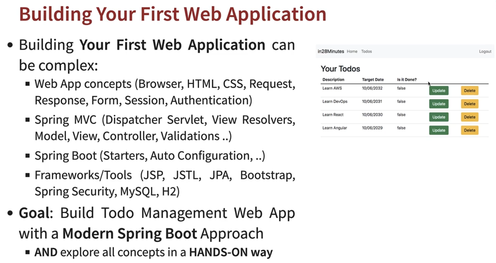
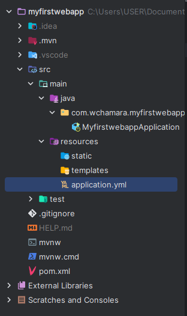

# 07---Build-Java-Web-Application-with-Spring-Framework,-Spring-Boot-and-Hibernate

## 002 Step 00 - Introduction to Building Web App with Spring Boot




## 003 Step 01 - Creating Spring Boot Web Application with Spring Initializr

use [Spring Initializr](https://start.spring.io/)

project: `Web`,`devtools` dependencies

## 004 Step 02 - Quick overview of Spring Boot Project

```yml
spring:
  application:
    name: myfirstwebapp
```



```xml
<?xml version="1.0" encoding="UTF-8"?>
<project xmlns="http://maven.apache.org/POM/4.0.0" xmlns:xsi="http://www.w3.org/2001/XMLSchema-instance"
 xsi:schemaLocation="http://maven.apache.org/POM/4.0.0 https://maven.apache.org/xsd/maven-4.0.0.xsd">
 <modelVersion>4.0.0</modelVersion>
 <parent>
  <groupId>org.springframework.boot</groupId>
  <artifactId>spring-boot-starter-parent</artifactId>
  <version>3.2.3</version>
  <relativePath/> <!-- lookup parent from repository -->
 </parent>
 <groupId>com.wchamara</groupId>
 <artifactId>myfirstwebapp</artifactId>
 <version>0.0.1-SNAPSHOT</version>
 <name>myfirstwebapp</name>
 <description>Demo project for Spring Boot</description>
 <properties>
  <java.version>21</java.version>
 </properties>
 <dependencies>
  <dependency>
   <groupId>org.springframework.boot</groupId>
   <artifactId>spring-boot-starter-web</artifactId>
  </dependency>

  <dependency>
   <groupId>org.springframework.boot</groupId>
   <artifactId>spring-boot-devtools</artifactId>
   <scope>runtime</scope>
   <optional>true</optional>
  </dependency>
  <dependency>
   <groupId>org.springframework.boot</groupId>
   <artifactId>spring-boot-starter-test</artifactId>
   <scope>test</scope>
  </dependency>
 </dependencies>

 <build>
  <plugins>
   <plugin>
    <groupId>org.springframework.boot</groupId>
    <artifactId>spring-boot-maven-plugin</artifactId>
   </plugin>
  </plugins>
 </build>

</project>
```

## 005 Step 03 - First Spring MVC Controller, @ResponseBody, @Controller

```java
package com.wchamara.myfirstwebapp.hello;

import org.springframework.stereotype.Controller;
import org.springframework.web.bind.annotation.GetMapping;
import org.springframework.web.bind.annotation.RequestMapping;
import org.springframework.web.bind.annotation.ResponseBody;

@Controller
public class SayHelloController {
    @RequestMapping("/say-hello")
    @ResponseBody
    public String sayHello() {
        return "Hello, World!";
    }
}
```

This code is written in Java and uses the Spring Framework, a popular framework for building web applications in Java. The code defines a controller class, SayHelloController, which is responsible for handling incoming web requests.

The @Controller annotation at the top of the class declaration is a special marker, telling Spring that this class should be treated as a controller. Controllers in Spring are components that handle HTTP requests and responses.

Inside the SayHelloController class, there's a method named sayHello(). This method is annotated with @RequestMapping("/say-hello"), which tells Spring that this method should be invoked whenever there's an HTTP request to the "/say-hello" URL path.

The @ResponseBody annotation indicates that the return value of the method should be sent straight to the HTTP response body. In other words, whatever string this method returns will be what the client (e.g., a web browser) receives.

The sayHello() method itself is quite simple: it just returns the string "Hello, World!". So, when a client sends a request to "/say-hello", they will receive a response with "Hello, World!" as the body.

In summary, this code sets up a simple web server that responds with "Hello, World!" when it receives a request at the "/say-hello" URL.

## 006 Step 04 - 01 - Enhancing Spring MVC Controller to provide HTML response

```java
package com.wchamara.myfirstwebapp.hello;

import org.springframework.stereotype.Controller;
import org.springframework.web.bind.annotation.RequestMapping;
import org.springframework.web.bind.annotation.ResponseBody;

@Controller
public class SayHelloController {
    @RequestMapping("/say-hello")
    @ResponseBody
    public String sayHello() {
        return "Hello, World!";
    }

    @RequestMapping("/say-hello-in-html")
    @ResponseBody
    public String sayHelloInHTML() {

        StringBuffer html = new StringBuffer();
        html.append("<html>");
        html.append("<head>");
        html.append("<title>Home</title>");
        html.append("</head>");
        html.append("<body>");
        html.append("<h1>Home</h1>");
        html.append("<p>Welcome to the home page updated</p>");
        html.append("<a href=\"about.php\">About</a>");
        html.append("<a href=\"contact.php\">Contact</a>");
        html.append("</body>");
        html.append("</html>");


        return html.toString();
    }
}
```

The provided code is a method named sayHelloInHTML() in a Spring controller class. This method is designed to handle HTTP requests directed to the "/say-hello-in-html" URL path, as indicated by the @RequestMapping("/say-hello-in-html") annotation.

The @ResponseBody annotation tells Spring that the return value of this method should be sent directly to the HTTP response body. This means that the HTML code generated by this method will be sent to the client's browser for rendering.

Inside the sayHelloInHTML() method, a StringBuffer named html is created. StringBuffer is a thread-safe, mutable sequence of characters. It's used here to build an HTML document as a string.

The append() method of StringBuffer is used to add HTML tags and content to the html object. The HTML document constructed here includes a head section with a title, a body section with a heading, a paragraph, and two links.

Finally, the toString() method is called on the html object to convert the StringBuffer to a String. This string, which represents an entire HTML document, is returned by the sayHelloInHTML() method. When a client sends a request to "/say-hello-in-html", they will receive this HTML document as the response.

## 007 Step 04 - 02 - Exploring Step By Step Coding and Debugging Guide

```xml
<dependency>
    <groupId>org.apache.tomcat.embed</groupId>
    <artifactId>tomcat-embed-jasper</artifactId>
</dependency>
```

In this specific selection, a dependency for tomcat-embed-jasper is declared. This is a library provided by Apache Tomcat, which is an open-source implementation of the Java Servlet, JavaServer Pages, Java Expression Language, and Java WebSocket technologies.

The tomcat-embed-jasper artifact provides the Jasper 2 JSP (JavaServer Pages) engine, which is used to compile JSPs into servlets. This dependency is typically included when you want to enable JSP support in an embedded Tomcat server.

The groupId represents the project's group, artifactId is the name of the jar without version, and the version (not shown in the selection) would represent the version of the artifact.

## 009 Step 05 - Redirect to a JSP using Spring Boot - Controller, @ResponseBody & View

```java
package com.wchamara.myfirstwebapp.hello;

import org.springframework.stereotype.Controller;
import org.springframework.web.bind.annotation.RequestMapping;
import org.springframework.web.bind.annotation.ResponseBody;

@Controller
public class SayHelloController {
    @RequestMapping("/say-hello")
    @ResponseBody
    public String sayHello() {
        return "Hello, World!";
    }

    @RequestMapping("/say-hello-in-html")
    @ResponseBody
    public String sayHelloInHTML() {

        StringBuffer html = new StringBuffer();
        html.append("<html>");
        html.append("<head>");
        html.append("<title>Home</title>");
        html.append("</head>");
        html.append("<body>");
        html.append("<h1>Home</h1>");
        html.append("<p>Welcome to the home page updated</p>");
        html.append("<a href=\"about.php\">About</a>");
        html.append("<a href=\"contact.php\">Contact</a>");
        html.append("</body>");
        html.append("</html>");


        return html.toString();
    }

    /**
         * Handles the request for "/say-hello-jsp" and returns the name of the JSP file to render.
         *
         * @return The name of the JSP file to render ("sayHello").
         */
        @RequestMapping("/say-hello-jsp")
        public String sayHelloJsp() {
            return "sayHello";
        }
}
```


```jsp
<html>
<head>
    <title>Home</title>
</head>
<body>
<h1>Home of JSP</h1>
<p>Welcome to the home page</p>
<a href="about.php">About</a>
<a href="contact.php">Contact</a>
</body>
</html>

```

```yml
spring:
  application:
    name: myfirstwebapp
  mvc:
    view:
      prefix: /WEB-INF/jsp/
      suffix: .jsp
logging:
  level:
    org:
      springframework:
        web: DEBUG

```

The prefix property is set to /WEB-INF/jsp/. This tells the view resolver that the JSP files are located in the /WEB-INF/jsp/ directory of the application.

The suffix property is set to .jsp. This tells the view resolver that the files it should look for will have names ending with .jsp.

So, for example, if a controller method returns a view name of home, the view resolver will look for a file named /WEB-INF/jsp/home.jsp to render as the view.

his configuration is used to set the logging level for classes in the org.springframework.web package to DEBUG. The logging level controls the amount of detail provided in the application's log output.

In the hierarchy of logging levels, DEBUG is one level below INFO, meaning it includes all INFO messages plus additional more detailed messages useful for debugging. The levels from least to most detailed are OFF, FATAL, ERROR, WARN, INFO, DEBUG, and TRACE.

By setting the logging level to DEBUG for org.springframework.web, you're asking Spring Boot to output more detailed log messages for classes in this package, which can be helpful for troubleshooting issues related to Spring's web functionality.

```xml
<dependency>
    <groupId>org.apache.tomcat.embed</groupId>
    <artifactId>tomcat-embed-jasper</artifactId>
</dependency>
```

The tomcat-embed-jasper library is a part of Apache Tomcat, an open-source implementation of the Java Servlet, JavaServer Pages, Java Expression Language, and Java WebSocket technologies. This library provides the Jasper 2 JSP (JavaServer Pages) engine, which is used to compile JSPs into servlets. This dependency is typically included when you want to enable JSP support in an embedded Tomcat server.

Note that this snippet does not include a version element, which is typically used to specify the version of the dependency that the project should use. If the version element is not included, Maven will use the latest version of the dependency that is available in the repositories it has access to.

## 010 Step 06 - Exercise - Creating LoginController and login view

## 011 Step 07 - Quick Overview - How does web work - Request and Response

## 012 Step 08 - Capturing QueryParams using RequestParam and First Look at Model

## 013 Step 09 - Quick Overview - Importance of Logging with Spring Boot

## 014 Step 10 - Understanding DispatcherServlet, Model 1, Model 2 and Front Controller

## 015 Step 11 - Creating a Login Form

## 016 Step 12 - Displaying Login Credentials in a JSP using Model

## 017 Step 13 - Add hard coded validation of userid and password

## 018 Step 14 - Getting started with Todo Features - Creating Todo and TodoService

## 019 Step 15 - Creating first version of List Todos Page

## 020 Step 16 - Understanding Session vs Model vs Request - @SessionAttributes

## 021 Step 17 - Adding JSTL to Spring Boot Project and Showing Todos in a Table

## 023 Step 18 - Adding Bootstrap CSS framework to Spring Boot Project using webjars

## 024 Step 19 - Formatting JSP pages with Bootstrap CSS framework

## 025 Step 20 - Lets Add a New Todo - Create a new View

## 026 Step 21 - Enhancing TodoService to add the todo

## 027 Step 22 - Adding Validations using Spring Boot Starter Validation

## 028 Step 23 - Using Command Beans to implement New Todo Page Validations

## 029 Step 24 - Implementing Delete Todo Feature - New View

## 030 Step 25 - Implementing Update Todo - 1 - Show Update Todo Page

## 031 Step 26 - Implementing Update Todo - 1 - Save changes to Todo

## 033 Step 27 - Adding Target Date Field to Todo Page

## 035 Step 28 - Adding a Navigation Bar and Implementing JSP Fragments

## 036 Step 29 - Preparing for Spring Security

## 037 Step 30 - Setting up Spring Security with Spring Boot Starter Security

## 038 Step 31 - Configuring Spring Security with Custom User and Password Encoder

## 039 Step 32 - Refactoring and Removing Hardcoding of User Id

## 040 Step 33 - Setting up a New User for Todo Application

## 041 Step 34 - Adding Spring Boot Starter Data JPA and Getting H2 database ready

## 042 Step 35 - 01 - Configuring Spring Security to Get H2 console Working

## 043 Step 36 - Making Todo an Entity and Population Todo Data into H2

## 044 Step 37 - Creating TodoRepository & Connecting List Todos page from H2 database

## 045 Step 38 - 01 - Connecting All Todo App Features to H2 Database

## 046 Step 38 - 02 - Exploring Magic of Spring Boot Starter JPA and JpaRepository

## 047 Step 39 - OPTIONAL - Overview of Connecting Todo App to MySQL database

## 048 Step 40 - OPTIONAL - Installing Docker

## 051 Step 41 - OPTIONAL - Connecting Todo App to MySQL database
